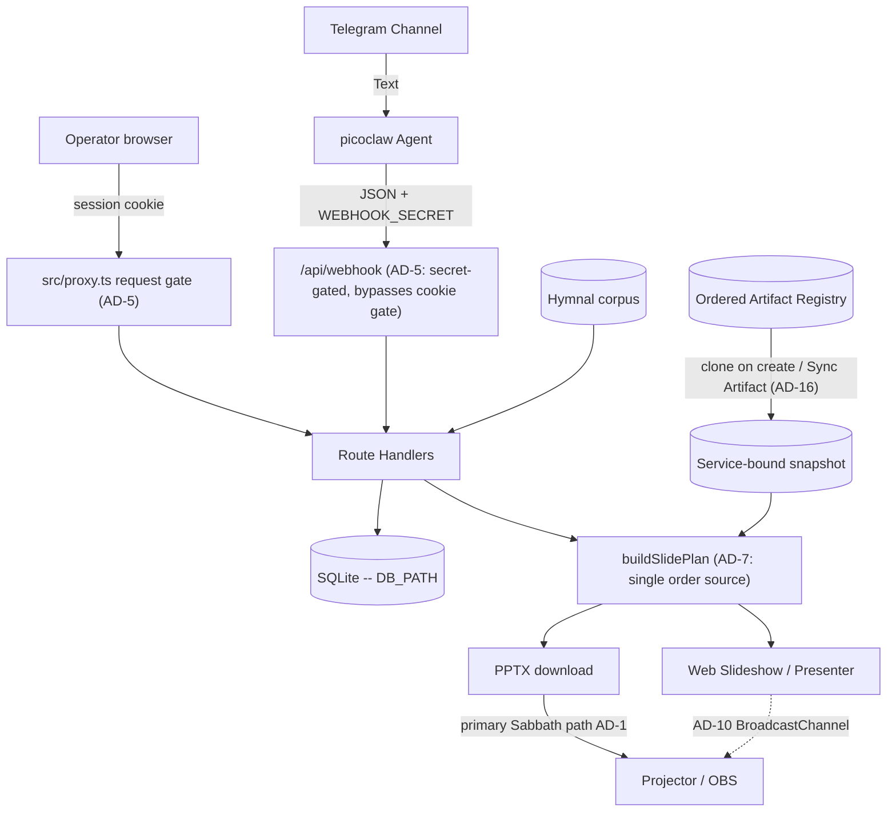
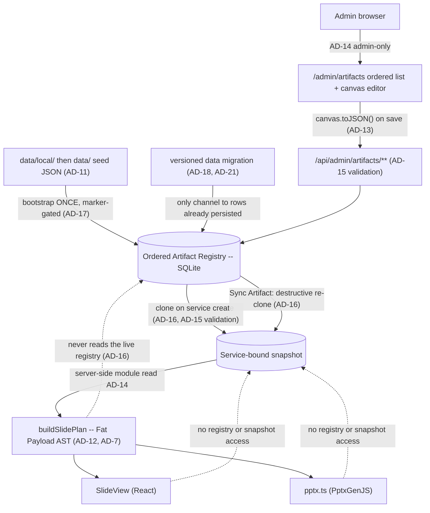

# Architecture Spine — BIC Worship Presentation Automation

**One spine per project.** This is the project's only architecture spine. The Epic 16 child spine was folded in on 2026-07-30 — see *AD map* below for the renumbering, and `../architecture-epic-16/` for that run's memlog, case study, and review records.

## Design Paradigm

**Monolithic Next.js app (App Router UI + API routes)**
One deployable unit serves the operator Web Hub, JSON APIs (webhook/services), hymnal lookups, PPTX generation, web slideshow, presenter mode, and the admin Artifact Registry / canvas editor. Server Components are the default; `'use client'` is added only where hooks, browser APIs, or event handlers require it. Operators/agents follow `.claude/skills/picoclaw-webhook/` to POST the webhook JSON API (skill docs, not an in-process runtime). **Offline PPTX remains the primary Sabbath path**; in-browser slideshow / presenter are also shipped (FR-15 / FR-16).

**Within it: data-driven presentation rendering with a decoupled editor** (AD-11..AD-22). Slide layout is a JSON layout AST rather than hardcoded switch-statements; an uncontrolled canvas editor owns the design, and both renderers (React web, PptxGenJS) are dumb consumers of pre-hydrated ASTs. Epic 20 turns that registry from a template catalog into the **ordered** surface where the deck itself is authored.

## AD map — the 2026-07-30 fold-in

The Epic 16 spine numbered its own decisions from 1, so folding it in required renumbering. Old citations resolve through this table, and every affected `AD-n` heading below carries its former identity inline. `AGENTS.md`'s standing rule — never renumber an existing `AD-n` — was waived once, by the owner, for this merge only; every live citation in the repo was repaired in the same change set.

| Was | Now | Decision |
| --- | --- | --- |
| `epic-16 AD-1` | **AD-11** | Artifact Registry Storage |
| `epic-16 AD-2` | **AD-12** | Slide Plan Data Flow (Fat Payload) |
| `epic-16 AD-3` | **AD-13** | Canvas State Boundary |
| `epic-16 AD-4` | **AD-14** | Global Template Administration |
| `epic-16 AD-5` | **AD-15** | Stable Layout Identity |
| `epic-16 AD-6` | **AD-16** | Service-Bound Registry Snapshot |
| `epic-16 AD-7` | **AD-17** | The Seed Is a Bootstrap |
| `epic-16 AD-8` | **AD-18** | Vocabulary and Value Changes |
| `epic-16 AD-9` | **AD-19** | Cross-Boundary Binding Keys |

`INIT AD-n` was the old citation form for AD-1..AD-10 of this file. Those numbers did not change; drop the prefix. The fold-in also removes a real hazard: `AD-6` and `AD-9` each used to mean two different decisions depending on which document you were reading.

**Where AD-11..AD-19 were decided:** in `../architecture-epic-16/.memlog.md`, listed above as a companion of record. This file's own memlog holds the fold-in and everything decided since; that one holds the nine decisions themselves, with the reasoning and the alternatives declined. A resume that reads only this memlog will not find them.

## Invariants & Rules

### AD-1 — Web Hub + Offline PPTX (Phase sequencing)
- **Binds:** Presentation rendering, Operator experience
- **Prevents:** Dependency on venue internet during Sabbath services
- **Rule:** Operators use a zero-install **Web Hub** for review/run-sheet. **Phase 1** presents on Sabbath from a downloadable offline **PPTX**. In-browser Web Slideshow / Presenter Mode are **shipped** (FR-15 / FR-16) but are **not** the hard offline Sabbath guarantee; PPTX download remains primary for venue reliability. A registry or layout change may not make Sabbath rendering depend on hub connectivity.

### AD-2 — Single Repository Monolith
- **Binds:** Code organization, deployment
- **Prevents:** Operational complexity and synchronization issues for a solo developer
- **Rule:** The picoclaw skill integration logic, API backend, and App Router web UI must reside in a single repository and be deployable as a cohesive unit. Registry storage, the admin editor UI, and both renderers are part of that unit; there is no separate editor service.

### AD-3 — Decoupled Ingestion and Presentation
- **Binds:** Data boundaries, external integrations
- **Prevents:** Tightly coupled integrations that would make replacing the Telegram/Agent ingestion difficult
- **Rule:** The API must expose a standard JSON interface for service generation that is agnostic to the input mechanism (Telegram/picoclaw). The presentation layer consumes this same API. Artifact templates are a presentation-layer concern; webhook/service intake JSON stays agnostic of layout templates.

### AD-4 — LiveServer durable paths (home PC production)
- **Binds:** Deployment, SQLite, announcement uploads
- **Prevents:** Ephemeral container-only data loss
- **Rule:** Production runs as one Docker/standalone unit on the home-PC LiveServer (`presenter.example.church` via Cloudflare Tunnel). Host-durable paths for `DB_PATH`, PPTX cache, and `UPLOADS_DIR` (compose bind-mounts). Operator details: `README-deployment.md` / `docs/deploy.md`. Announcement image refs are remote http(s) (SSRF-hardened) **or** hub-local `/api/uploads/<32-hex>.(jpg|jpeg|png|gif|webp)` resolved from disk for PPTX. Registry rows and per-service registry snapshots live in that same durable `DB_PATH`; editor image references resolve through the existing `UPLOADS_DIR` / allowlist rules, never new ad-hoc paths.

### AD-5 — Single request gate in `src/proxy.ts` [ADOPTED]
- **Binds:** every route and page; authentication and authorization
- **Prevents:** per-route authorization drift, and privilege that survives demotion, logout, or password change
- **Rule:** `src/proxy.ts` is the one request gate, and its `config.matcher` regex **is** the authorization boundary — anything it does not match is served with no session check at all, so a new exclusion ships together with its assertion in `tests/proxy-matcher.test.mjs` in the same change set. The gate re-checks every session against SQLite (deleted account, role demotion, stale `token_version`, revoked `sid`) and **fails closed** if that lookup throws. Privileged routes additionally call `requireSession` / `requireAdminSession`; the cookie's `role` claim is never trusted alone. `/api/webhook` is gated by `WEBHOOK_SECRET` only — 503 when unset, 401 when wrong or missing — never by a cookie. Post-login `next` targets pass through `safeNextPath`. Every gated response carries `Cache-Control: private, no-store` and `Vary: Cookie`, because the hub is published through a Cloudflare Tunnel where an edge cache rule could otherwise serve a rendered private page without the origin — and therefore without this gate — ever running. Do not export `runtime` from the Proxy file (Next throws), and do not reintroduce `middleware.ts`: it compiles for the Edge runtime and loses the per-request SQLite re-check.

### AD-6 — Optimistic concurrency on service edits [ADOPTED]
- **Binds:** service mutation APIs, hub edit UI, agent/webhook corrections, registry template writes, Sync Artifact
- **Prevents:** an operator's edit silently erased by a late correction (last-write-wins)
- **Rule:** every service mutation carries the client's `updated_at` as a precondition; a stale value is rejected with HTTP 409 and the client re-reads before retrying. No write path may bypass the precondition. This covers registry writes and the **Sync Artifact** action of AD-16 — the shipped shape is `expectedUpdatedAt` / `RegistryStaleError` in `src/lib/registry/store.ts`.

### AD-7 — `buildSlidePlan` is the only slide-order source [ADOPTED]
- **Binds:** PPTX generation, web slideshow, presenter + projector
- **Prevents:** divergent slide order or content between what the operator controls and what the congregation sees
- **Rule:** `buildSlidePlan` is the single source of slide order and content for every surface. No surface recomputes order from service fields or keeps its own ordering logic; a rendering or ordering change lands in the plan, never per-surface. AD-12's Fat Payload specializes this rule; AD-16 changes only where the plan reads its templates from, never that there is one order source.

### AD-8 — Image references resolve only through shared safety helpers [ADOPTED]
- **Binds:** announcement images, hub uploads, registry/asset references, PPTX embedding
- **Prevents:** a new surface reintroducing SSRF or unsafe content through its own laxer resolver
- **Rule:** image references resolve only through the shared helpers in `src/lib` — allowlisted remote http(s) and hub-local `/api/uploads/<32-hex>.(jpg|jpeg|png|gif|webp)` for announcements, and registry `/assets/...` refs for Artifact templates. A new reference vocabulary extends an existing helper or adds one alongside them with the same fail-closed default; no unit ships an inline resolver. The canvas editor introduces no second resolver and admits no `data:` or arbitrary remote URI.

### AD-9 — Schema evolution through startup DDL only [ADOPTED]
- **Binds:** SQLite schema, and the bootstrap path it shares with AD-18
- **Prevents:** two sources of schema truth between a developer machine and a fresh production container
- **Rule:** schema changes go through the app's startup DDL on the `getDb` path. No migration framework (Prisma or otherwise) is introduced without an explicit product decision recorded in this spine. Registry tables are created on that same path. **The bootstrap path is shared, and the division is fixed:** this rule owns *schema* — the shape, e.g. adding a column — while **AD-18** owns *value* migration — the contents, e.g. rewriting every row's `base_type`. Neither licenses the other's mechanism: a value change is not a reason to add a framework, and a schema change is not a reason to rewrite data.

### AD-10 — One presenter sync channel, client-side only [ADOPTED]
- **Binds:** presenter, projector, web slideshow
- **Prevents:** a split sync topology where the projector follows one controller and ignores another
- **Rule:** presenter↔projector sync goes through the single `@/lib/present-channel` `BroadcastChannel` module; no surface opens its own channel name or message shape. No server realtime channel (WebSocket/SSE) is introduced unless product direction changes — keeping the venue path independent of hub connectivity, per AD-1. A registry edit must not add a second channel to push template changes to a live projector.

### AD-11 — Artifact Registry Storage *(was `epic-16 AD-1`)*
- **Binds:** Database schema, the Canvas Editor's save API, and the startup seed path.
- **Prevents:** Data loss on ephemeral container filesystems, file-lock concurrency issues, and a seeder that overwrites administrator edits or leaks private seed content.
- **Rule:** The live Artifact Registry is stored in SQLite on the durable `DB_PATH` (AD-4). Filesystem JSON serves exclusively as a startup seed: startup inserts missing template IDs and **never** overwrites persisted administrator edits. Reset restores one selected template from that seed. The seed is two-layered — `data/local/default-registry.json` is git-ignored and **takes precedence over the shipped `data/default-registry.json` example whenever present**; a seeder that reads only the shipped example breaks the mechanism that keeps congregation data out of a public repository.
- **Superseded in part by AD-17 (2026-07-30):** the *"startup inserts missing template IDs"* clause only. Storage target, the two-layer seed precedence, Reset-from-seed, and "never overwrites administrator edits" all stand as written.

### AD-12 — Slide Plan Data Flow (Fat Payload) *(was `epic-16 AD-2`)*
- **Binds:** The `buildSlidePlan` return type and all downstream renderers.
- **Prevents:** The Web (`SlideView`) and PPTX renderers from performing independent database lookups or maintaining their own diverging layout logic.
- **Rule:** `buildSlidePlan` outputs a fully hydrated AST (Fat Payload) with exact rendering coordinates, fonts, colors, and resolved text content. Specializes AD-7: the plan is the single order *and* layout source, so a renderer never reaches the registry itself.

### AD-13 — Canvas State Boundary *(was `epic-16 AD-3`)*
- **Binds:** The React-Fabric integration layer.
- **Prevents:** Two-way data binding lag, stuttering drags, and unnecessary React re-renders.
- **Rule:** The Canvas Editor uses an Uncontrolled Wrapper pattern. Fabric.js owns the canvas state exclusively; React only reads state via `canvas.toJSON()` when the save button is clicked.

### AD-14 — Global Template Administration *(was `epic-16 AD-4`)*
- **Binds:** `/admin/artifacts`, `/api/admin/artifacts/**`, and the registry access layer.
- **Prevents:** Per-service template drift and operator-level mutation of every service's visual contract.
- **Rule:** Artifact templates are global across services. Registry management UI and APIs are admin-only and re-check the current account role from SQLite — a specialization of AD-5, not a separate authorization scheme. `/admin/artifacts` and `/api/admin/artifacts/**` are inside the AD-5 matcher, and adding a registry route outside it requires the same-change-set test update AD-5 demands. Downstream planners and renderers read the registry through server-side modules rather than the management API.
- **Superseded in part by AD-16 (2026-07-30):** the *"global across services"* clause only — a service now reads its own cloned snapshot. The admin-only authorization clause and the read-through-server-side-modules clause are **untouched** and still bind; the second now points at the snapshot instead of the live registry. Not to be confused with AD-4 (LiveServer durable paths), which is a different decision and is not affected.

### AD-15 — Stable Layout Identity *(was `epic-16 AD-5`)*
- **Binds:** Seed data, every write path into the registry, hydration, and both renderers.
- **Prevents:** Unit-specific renderer drift, required-placeholder deletion, and unsafe image references reaching a renderer through an unvalidated back door.
- **Rule:** Layouts use a fixed 16:9 canvas with normalized percentage coordinates and stable template/layout/element/placeholder IDs. Coordinates may extend beyond the canvas to preserve intentional source-deck clipping. **Every** write into the registry is untrusted and must pass the same structural and image-reference validation before persistence — the canvas save API, the startup seeder, and any import or asset-extraction script alike. Image refs validate through the shared helper required by AD-8; no write path ships its own check.

### AD-16 — Service-Bound Registry Snapshot *(was `epic-16 AD-6`)*
- **Supersedes:** the *"global across services"* clause of AD-14, and nothing else in it. Recorded as a separate decision so the reversal stays visible.
- **Binds:** service creation, the Sync Artifact action, `buildSlidePlan`'s template input, and every read path a service surface uses.
- **Prevents:** a live registry edit shifting the structure under a service an operator is preparing right now, and a weekly value entered against one structure being orphaned by a later structural change — and, in the other direction, a service with no way to be brought up to date.
- **Rule:** Creating a worship service **clones** the ordered live registry — order, kinds, labels, layouts, placeholder bindings — into a **service-bound snapshot** on the durable `DB_PATH` (AD-4); creation is the only freeze event. A service's plan, Presenter, slideshow and PPTX read that snapshot; a live registry edit reaches an existing service **only** through the explicit **Sync Artifact** action, which replaces the snapshot destructively. Sync is permitted on **any** service, carries the service's `updated_at` precondition (AD-6), and may not alter the service's entered data (*State* convention) — "destructive" means it replaces the snapshot, never that it may overwrite a service someone else has moved underneath it. The clone and the re-clone are write paths and validate under AD-15 like every other. **Announcement membership is not cloned:** the Announcements master list stays live and reaches an existing service at render time (CAP-7). **A later structural change obliges nobody to keep an older snapshot renderable** — what the snapshot protects is the service's entered supporting data, not its ability to regenerate a past deck. The snapshot is the sequence *input*: `buildSlidePlan` remains the single source of order and layout (AD-7, AD-12), and no renderer reads a snapshot directly any more than it read the registry.

### AD-17 — The Seed Is a Bootstrap, Not a Correction Channel *(was `epic-16 AD-7`)*
- **Supersedes:** the *"startup inserts missing template IDs"* clause of AD-11.
- **Binds:** the `getDb` startup path, the registry store's insert path, the delete verb, and the registry's ordering column.
- **Prevents:** an administrator's delete, rename or reorder being silently undone by an unrelated restart. A deleted row leaves no evidence behind, so a seeder that inserts "missing" IDs cannot tell *deleted on purpose* from *never existed here* — it resurrects the row on every boot, forever.
- **Rule:** The seeder initialises data **from zero only** — first install, first run — and is gated by a marker in `settings`. It is never a gap-filler: after it has run, boot never inserts, re-seeds, relabels or reorders a registry row; the administrator owns every row that exists, and the ordered registry is authored data rather than shipped data kept in sync. A gap in a database that already holds data travels as a versioned data migration (AD-18, AD-21), never as a re-seed. **AD-11's two-layer seed is therefore read only at first boot:** a deployment that boots once and drops `data/local/default-registry.json` in afterwards is never seeded from it. Restoring shipped content stays possible as an **explicit administrator action** — Reset-from-seed per template, per AD-11 — never as a side effect of a restart, and never as a bulk re-seed of a live database.

### AD-18 — Vocabulary and Value Changes Travel as Explicit One-Time Migrations *(was `epic-16 AD-8`)*
- **Superseded in part by AD-21 (2026-07-30):** the *"marker-gated"* mechanism clause only — one version counter replaces the per-change boolean. Everything else stands: values reach persisted rows only through an explicit migration on the startup path, and no framework arrives with it.
- **Binds:** the `base_type` value set, `READ_ONLY_BASE_TYPES` / `EDITABLE_BASE_TYPES`, the registry validator, and any future change to persisted registry values.
- **Prevents:** a shipped vocabulary change reaching persisted rows through boot-time re-seed (which AD-17 removed) or not reaching them at all — and the opposite failure, a migration framework arriving by the back door.
- **Rule:** AD-9 fixes *schema* evolution on the startup DDL path and is silent on **value** migration; this decision fills that silence rather than weakening it. A shipped change that must reach rows already persisted travels as an **explicit, one-time migration** on the startup path, versioned per AD-21. It is not a migration framework and AD-9's prohibition stands: no Prisma, no versioned migration directory, without an explicit product decision recorded in this spine. **Until first deploy** no production rows exist, so Epic 20's seven-`base_type`-to-three-kind collapse ships as a **total replacement** — no backward compatibility, no migration over live rows — folding into production data version 1 (AD-21); at first deploy that licence ends, and the same change would need a migration over live `artifact_templates` rows. A migration operates on the **live registry** and does **not** rewrite service snapshots — structure reaches an existing service only through Sync Artifact (AD-16), so a migration that rewrote snapshots would be a second structural channel. An older snapshot may therefore stop being renderable, which AD-16 accepts; what must survive is the **entered data**.

### AD-19 — A Cross-Boundary Key Is a Server-Owned Value the Administrator Cannot Edit *(was `epic-16 AD-9`)*
- **Binds:** the `base_type` enumeration, the four predefined SongSet slots, the Placeholder Catalog key set, the worship-service settings form, and every write path into the registry.
- **Prevents:** two independently-built units agreeing to disagree about a key — the registry surface and the worship-service settings form picking different handles for the same SongSet slot, and the canvas editor's insert list drifting from what the validator actually admits.
- **Rule — the kind vocabulary and the SongSet slot key:** the kind vocabulary is exactly the three the SPEC fixes — `general`, `song-set`, `announcement`. `text-placeholder`, `image-placeholder`, `mix-placeholder` and `fullscreen-image` are **gone rather than renamed**: a placeholder stops being a kind and becomes an element inserted onto a General from the Placeholder Catalog. Only `song-set` expands, into four slot identities — `songset-bt-open`, `songset-bt-close`, `songset-ds-open`, `songset-ds-close` — and that identity **is** the key the worship-service settings form binds a hymnal number to. `song-set` names the kind, never an entry: an entry carries one of the four slot identities. **The recognized set is therefore closed and complete** — `general`, the four `songset-*` slots, `announcement`: six keys over three kinds, and no write path admits a seventh. Reordering rows changes the presented sequence (CAP-8) without touching a binding; renaming a label cannot touch one either. Three requirements make the scheme unambiguous rather than merely convenient: the slot identity is **never administrator-editable**, **at most one registry row may carry each slot identity**, and the identity is a **semantic name, never an ordinal** (`songset1` re-imports the positional reading this decision exists to remove). The chosen spelling is a persisted binding key, so changing it later is the versioned data migration AD-18 and AD-21 govern. A binding whose slot row has been deleted is **inert**, not an error: the slot does not appear, because the administrator removed that song from the order — and the entered hymnal number survives in the service's own data, which AD-16 requires regardless. Extending the vocabulary — a fifth slot, a fourth kind — is a code-plus-tests change, never administrator configuration.
- **Rule — Placeholder Catalog:** the admitted key set is server-side vocabulary enforced on **every** write path, the same treatment AD-8 and AD-15 gave image references, so *"the UI cannot invent a catalog key"* (CAP-4) is a property of the registry rather than of one client. Its key spelling is persisted into saved layouts, so that spelling too falls under AD-18 and AD-21 once chosen. Independent of the SongSet clause above.

### AD-20 — The Planner Injects Nothing the Registry Did Not Ask For
- **Binds:** `buildSlidePlan`, the registry seed, the ordered registry, and every liturgical rule about which slides exist.
- **Prevents:** a liturgical decision requiring a code change and a deploy, and the planner keeping a second, invisible source of deck content alongside the registry.
- **Rule:** every slide in the deck originates from an ordered registry entry. `buildSlidePlan` **applies** rules; it does not **hold** them. Fixed liturgical content — the standing responses `#671` and `#684`, the closing *We Have This Hope* — is authored as **General** entries and edited by hand, never injected by the planner and never computed from the hymnal. Because a General generates no title slide, the `skipTitle` mechanism is **removed rather than migrated**: there is nothing left to suppress. Changing or adding a liturgical song is a registry edit.

### AD-21 — Persisted Data Carries One Version Number, and Unreleased Transitions Compact Into One
- **Supersedes:** the mechanism clause of AD-18 — the per-change boolean marker, precedent `artifact_seed_hash_backfilled`. AD-18's rule that persisted rows change only through an explicit migration, and its prohibition on a migration framework, stand untouched.
- **Binds:** the persisted data version in `settings`, every data migration on the `getDb` startup path, the release procedure, and the developer database lifecycle.
- **Prevents:** two builders keying the same change incompatibly — one adding a per-change boolean, another bumping a counter — and a production database accumulating one transition per code change, so that its version history tracks development activity instead of releases.
- **Rule:** All persisted data shares **one monotonic version number** in `settings` — one counter for the whole database, never one per table or per domain, so that "which version is production on" has a single answer. A change that must reach data already persisted is declared **explicitly while it is being coded**, as the transition from version *n* to *n+1*; it is never inferred at deploy time. **An unreleased transition is not yet history and may be rewritten:** the whole batch of unreleased transitions is compacted into a single transition before it reaches production, and developer databases are **reset** to the compacted version rather than migrated through the steps it replaces. **A released version is frozen** — once a version has reached production it is never renumbered, re-cut, or folded into another. Small steps are a development convenience and stop at the merge; production sees one transition per release. AD-17's seeding marker and this counter are **distinct**, and neither substitutes for the other: the marker records that bootstrap ran, the counter records which data version is persisted. This is a counter and a convention, not a framework: AD-9's prohibition stands.

### AD-22 — Authoring Authority Is Fixed per Kind: Free Canvas, Bounded Config, or Bound to a Set
- **Binds:** the canvas editor, the SongSet configuration surface, the registry validator, and the plan's expansion of one entry into N slides.
- **Prevents:** the canvas editor and the validator disagreeing about what an administrator may author on a non-General entry — one opening a free canvas on a SongSet row and admitting an extra or rebound placeholder, the other refusing it — and CAP-3's *"General only"* living nowhere but in a capability statement.
- **Rule:** authoring authority is fixed per kind, and no surface widens it. **`general` is free canvas:** the administrator composes it from anything, including Placeholder Catalog keys (AD-19). **A `songset-*` row gets a bounded configuration surface, not a canvas:** exactly two background images — one for its title layout, one for its lyric layout, which verse and refrain share — plus font style and font size. Both background references resolve through the shared helper AD-8 requires: this surface is not the canvas editor and introduces no second resolver of its own. Layout composition itself is developer-owned seed data and is not exposed there; it stays registry data hydrated into the plan (AD-11, AD-12), never a coordinate held by a renderer. **Administrator-configured values must stay distinguishable from developer-authored layout**, because AD-21's migration has to rewrite the layout without discarding them and Reset keeps no second copy of them (AD-11); whether the distinction is an override record beside the layout or a marked field inside it is a schema call, not an invariant. The row's placeholder set and its SDAH slot binding are server-defined: nothing may be added, removed or rebound, and the validator refuses it on every write path (AD-15). **An `announcement` row is bound to the Announcements master set**, whose membership is not registry-authored at all (AD-16, CAP-7). Only those two kinds **expand** — a SongSet row into its title and lyric slides, an `announcement` row into N full-bleed images; a General is one slide. Because AD-17 reads the seed once, a developer's later change to a SongSet layout reaches a deployed database only as a versioned data migration (AD-21) — never by restart, and not by Reset, which would also discard the administrator's background and font choices (AD-11).

## Consistency Conventions

| Concern | Convention |
| --- | --- |
| Naming (entities, files) | kebab-case for directories/files, PascalCase for components, camelCase for variables/functions. |
| Data & formats | API responses use standard JSON envelopes (`{ error: string }` + explicit status on failure). Dates stored and transmitted in ISO 8601 UTC. |
| State | A service's **entered data is historical**: only that service's own mutation path changes it — an operator form edit (FR-11) or an authorized webhook correction (FR-12) — and never as a side effect of anything else. No registry edit, no **Sync Artifact**, and no value migration may alter a service's stored form input. Structure is the opposite: a service adopts a clone of the Artifact Registry at creation, and live structure reaches it only through Sync Artifact, permitted on any service (AD-16). A service is **not** required to regenerate a byte-identical deck later — what is kept is the entered data, not the rendering. Concurrent overwrite is arbitrated by AD-6's `updated_at` precondition, never last-write-wins. |
| Boundaries | Route handlers stay thin; parsing, PPTX, auth, images, announcements, and DB access live in `src/lib/*`. Registry logic lives in `src/lib/registry/*`, not in route handlers. better-sqlite3 is synchronous and server-only. |

## Stack

| Name | Version |
| --- | --- |
| Node.js | v20+ |
| Next.js | 16.2.10 (App Router, `output: "standalone"`) |
| React / React DOM | 19.2.4 |
| TypeScript | ^5 (strict) |
| Tailwind CSS | ^4 |
| better-sqlite3 (SQLite, WAL) | ^12.11.1 |
| pptxgenjs | ^4.0.1 |
| jszip | ^3.10.1 |
| fabric | ^6.6.1 (canvas editor) |
| @base-ui/react (shadcn base-nova) | ^1.6.0 |
| ESLint / eslint-config-next | ^9 / 16.2.10 |

`package.json` is the version authority; this table is a seed, re-verified row by row against it on 2026-07-30 with no drift found. Storage target, PPTX generator, and canvas library are fixed — the registry adds no parallel mechanism.

## Structural Seed

System-level dependency direction:



Registry detail — read *through* the plan, never by a renderer, and never through the management API:



```text
worship-presenter-web/
  src/proxy.ts       # THE request gate (AD-5). Not middleware.ts -- Next 16, Node runtime
  src/app/           # Next.js App Router UI + API routes (hub, webhook, services, slideshow, presenter, admin/artifacts)
  src/lib/           # parser, pptx, slide-plan, lyrics, db, images, uploads, scripture, auth/, registry/, present-channel
  src/components/    # Header (shared nav/profile) + artifacts/ + ui/ shadcn
  data/              # Normalized hymnal corpus (hymns.json); default-registry.json seed; SQLite path via DB_PATH
  data/local/        # git-ignored private seed overrides (preferred over the shipped example)
  data/uploads/      # default UPLOADS_DIR (durable host volume in LiveServer prod)
  tests/             # node:test suites incl. proxy-matcher + public-repo-guard (the enforced gates)
  .constitution/     # hard repository rules (public-repository.md)
  Dockerfile / docker-compose.yml  # LiveServer prod/dev profiles (standalone)
  scripts/           # import-hymnal, import:kjv, liveserver helpers
  .claude/skills/picoclaw-webhook/  # agent skill docs for webhook intake/readback (FR-1); not a runtime server
```

## Capability → Architecture Map

Present because two specs drove this spine. Read the right-hand column downward: a capability with no governing decision is a hole, and this table is where it shows.

**Epic 20 — `spec-artifact-registry-authoring`**

| Capability | Lives in | Governed by |
| --- | --- | --- |
| CAP-1 — one ordered registry defines which slides exist and in what sequence | `src/lib/registry/*` → `buildSlidePlan` | AD-7, AD-16, **AD-20** (the planner holds no rule of its own) |
| CAP-2 — add, delete, rename, reorder entries | `/admin/artifacts`, `/api/admin/artifacts/**` | AD-14 (admin-only), AD-17 (a delete stays deleted), AD-6 (precondition on every write) |
| CAP-3 — full canvas authoring, General only | `src/components/artifacts/`, canvas editor | **AD-22** (free canvas is General's alone), AD-13 (Fabric owns canvas state), AD-15 (every write validated) |
| CAP-4 — Placeholder Catalog inserted and styled locally | `src/lib/registry/validate.ts`, catalog vocabulary | AD-19 (key set is server-owned), **AD-22** (*locally* means on a General), AD-15 |
| CAP-5 — three kinds plus editable label, shown as `[kind] label` | registry types, ordered list UI | AD-19 (six recognized keys over exactly three kinds; label is admin-owned) |
| CAP-6 — service clones the registry; Sync Artifact re-clones | service create / Sync, service-bound snapshot | AD-16, AD-6 (Sync carries the precondition), AD-15 (clone is a validated write) |
| CAP-7 — Announcement is one entry expanding to N full-bleed images | `src/lib/announcements.ts` → plan | AD-16 (membership deliberately not frozen), AD-8 (image refs resolve through shared helpers) |
| CAP-8 — four SongSet slots with backgrounds and per-slot hymn numbers | registry rows + worship-service settings | AD-19 (slot identity is the binding key, immutable and unique), **AD-22** (two backgrounds per slot, on a bounded surface), AD-12 (expansion is hydrated into the plan) |

**Epic 16 — `spec-slide-artifact-model`**

| Area | Lives in | Governed by |
| --- | --- | --- |
| Registry storage and its seed | `src/lib/registry/store.ts`, `seed.ts` | AD-11, AD-17, AD-4 (durable `DB_PATH`) |
| Hydrated layout AST reaching both renderers | `slide-plan.ts` → `SlideView`, `pptx.ts` | AD-12, AD-7 |
| Canvas editor boundary | `src/components/artifacts/` | AD-13 |
| Layout identity and write validation | `src/lib/registry/validate.ts` | AD-15, AD-8 |
| Registry administration authorization | `src/proxy.ts` + admin routes | AD-5, AD-14 |
| Value and vocabulary evolution | `src/lib/db/index.ts` startup path | AD-9 (schema), AD-18 (values), AD-21 (one version counter, compacted per release) |

## Deferred

**Shipped (no longer deferred):** Per-person Admin/Operator auth (FR-18 / Story 6.2); Web Slideshow (FR-9/15); Telegram corrections + concurrency (FR-12/13b); PPTX retention (FR-10b); Presenter Mode (FR-16); KJV scripture display path (FR-19 UI/import — corpus commit still open below); **Auth hardening** (login rate-limit/lockout + session revocation on logout/password change — see `spec-auth-hardening-rate-limit-and-revocation.md`, now folded into AD-5); **Artifact Registry + canvas editor** (Epic 16 — AD-11..AD-15).

**Still deferred / open leftovers:**

- **FR-19 corpus ops:** KJV text not committed under `data/`; import from `.work/` / `import:kjv` remains an ops step.
- **Defence-in-depth on non-admin APIs:** nine routes rely on the AD-5 proxy gate as their only enforcement layer, with no in-route `requireSession`. Tracked in `deferred-work.md` and as Epic 18; revisit when a route becomes reachable outside the matcher.
- **Multi-Church Configuration:** BIC-only until v1 is proven; multi-tenant deferred.
- **SDAH lyric license/attribution:** Document church copyright status for `data/hymns.json`.
- **Observability:** no logging/metrics/alerting strategy is fixed at this altitude — `console.error` on the server is the current floor. Named here rather than left silent; revisit if the hub gains users beyond one congregation.
- Exact Canvas UI component layout (sidebar vs topbar) is a UX concern, not a structural invariant.
- **Where the snapshot lives physically** — a table keyed by service, or a payload column on `services` — is a Story 20.8 design call. AD-16 fixes only that it exists per service, is durable (AD-4), and is what the plan reads.
- **Where a SongSet slot identity is persisted** — in the `base_type` column itself, or in a discriminator beside it — is a Story 20.2 / 20.7 schema call. AD-19 fixes only that the identity exists, is unique, is server-owned, and is a semantic name.
- **Whether a stale snapshot is surfaced to the operator, and how**, is a UX concern owned by `EXPERIENCE.md`. AD-16 makes staleness possible by design and therefore makes the state real; it does not decide the affordance.
- **Reset now reverts a rename.** AD-17 gives the administrator `label`, and AD-11's Reset restores the shipped template including its label. Defensible — Reset means restore what we shipped — but it is a new operator-visible surprise, and it is an affordance question for `EXPERIENCE.md`, not an invariant.
- **AD-21's counter does not exist yet, and no story owns introducing it.** The shipped mechanism is still the boolean `artifact_seed_hash_backfilled` (`src/lib/db/index.ts`) that AD-21 supersedes; the counter, and the compaction of everything now in development into production data version 1, arrive with Epic 20's first release. Deferred as sequencing, not as an open question — the decision is made, only its landing story is unassigned. The same release is where AD-22's bounded surface loosens `READ_ONLY_BASE_TYPES` (`src/lib/registry/types.ts`), which today refuses every administrator edit to a `song-set` or `announcement` row at `ArtifactEditor.tsx:104` and `registry/store.ts:226`.
- **`seed_hash` and the self-healing reseed path become work without a job** once AD-17 lands: the automatic branch of `reseedArtifactTemplateIfUntouched`, most of `npm run registry:doctor`, and the assertion at `tests/registry-reseed.test.mjs` that a missing row *is* re-inserted. Retiring them is Story 20.1/20.3 implementation, not a structural decision — but that test must be **inverted, not deleted**, or the resurrection AD-17 forbids has no guard.
- **What AD-20 costs the three liturgical songs**, deferred to Story 20.1's seed work rather than decided here: their lyrics become canvas text, so they stop passing through the FR-5 verse/Reff splitter, stop tracking corrections to `data/hymns.json`, and need one General row per lyric page rather than one row per song. If they ship inside the committed `data/default-registry.json` they also duplicate corpus text that already lives in `data/hymns.json` — a second source of truth for the same lyrics, and it touches the open SDAH licence item above. Revisit when that seed is authored.
- Vocabulary additions the shipped validator does not admit — element rotation, layout-background opacity, image-element opacity — are deferred with evidence in `deferred-work.md`. Adding one is a registry-contract change, not a seed edit.
- Asset extraction for deck elements that have no registry element yet (e.g. the `offering-tithe` QR) is deferred; when it lands it is a *second* writer into the registry and is bound by AD-15.
