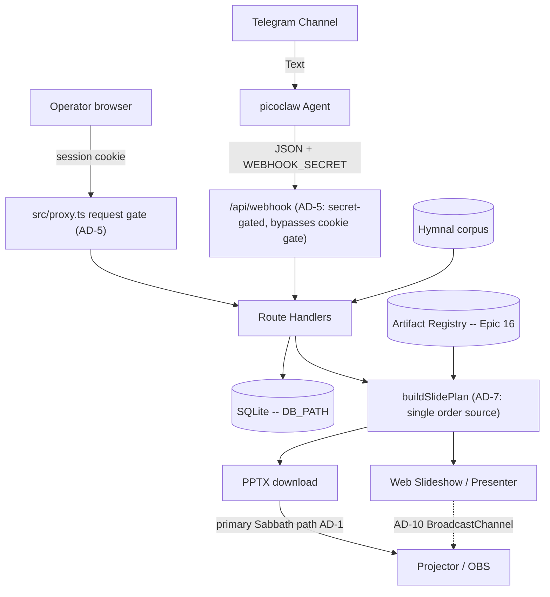

# Architecture Spine — BIC Worship Presentation Automation

## Design Paradigm

**Monolithic Next.js app (App Router UI + API routes)**
One deployable unit serves the operator Web Hub, JSON APIs (webhook/services), hymnal lookups, PPTX generation, web slideshow, presenter mode, and the admin Artifact Registry / canvas editor (Epic 16 — see `architecture-epic-16/`). Server Components are the default; `'use client'` is added only where hooks, browser APIs, or event handlers require it. Operators/agents follow `.claude/skills/picoclaw-webhook/` to POST the webhook JSON API (skill docs, not an in-process runtime). **Offline PPTX remains the primary Sabbath path**; in-browser slideshow / presenter are also shipped (FR-15 / FR-16).

## Invariants & Rules

### AD-1 — Web Hub + Offline PPTX (Phase sequencing)
- **Binds:** Presentation rendering, Operator experience
- **Prevents:** Dependency on venue internet during Sabbath services
- **Rule:** Operators use a zero-install **Web Hub** for review/run-sheet. **Phase 1** presents on Sabbath from a downloadable offline **PPTX**. In-browser Web Slideshow / Presenter Mode are **shipped** (FR-15 / FR-16) but are **not** the hard offline Sabbath guarantee; PPTX download remains primary for venue reliability.

### AD-2 — Single Repository Monolith
- **Binds:** Code organization, deployment
- **Prevents:** Operational complexity and synchronization issues for a solo developer
- **Rule:** The picoclaw skill integration logic, API backend, and App Router web UI must reside in a single repository and be deployable as a cohesive unit.

### AD-3 — Decoupled Ingestion and Presentation
- **Binds:** Data boundaries, external integrations
- **Prevents:** Tightly coupled integrations that would make replacing the Telegram/Agent ingestion difficult
- **Rule:** The API must expose a standard JSON interface for service generation that is agnostic to the input mechanism (Telegram/picoclaw). The presentation layer consumes this same API.

### AD-4 — LiveServer durable paths (home PC production)
- **Binds:** Deployment, SQLite, announcement uploads
- **Prevents:** Ephemeral container-only data loss
- **Rule:** Production runs as one Docker/standalone unit on the home-PC LiveServer (`presenter.example.church` via Cloudflare Tunnel). Host-durable paths for `DB_PATH`, PPTX cache, and `UPLOADS_DIR` (compose bind-mounts). Operator details: `README-deployment.md` / `docs/deploy.md`. Announcement image refs are remote http(s) (SSRF-hardened) **or** hub-local `/api/uploads/<32-hex>.(jpg|jpeg|png|gif|webp)` resolved from disk for PPTX.

### AD-5 — Single request gate in `src/proxy.ts` [ADOPTED]
- **Binds:** every route and page; authentication and authorization
- **Prevents:** per-route authorization drift, and privilege that survives demotion, logout, or password change
- **Rule:** `src/proxy.ts` is the one request gate, and its `config.matcher` regex **is** the authorization boundary — anything it does not match is served with no session check at all, so a new exclusion ships together with its assertion in `tests/proxy-matcher.test.mjs` in the same change set. The gate re-checks every session against SQLite (deleted account, role demotion, stale `token_version`, revoked `sid`) and **fails closed** if that lookup throws. Privileged routes additionally call `requireSession` / `requireAdminSession`; the cookie's `role` claim is never trusted alone. `/api/webhook` is gated by `WEBHOOK_SECRET` only — 503 when unset, 401 when wrong or missing — never by a cookie. Post-login `next` targets pass through `safeNextPath`. Every gated response carries `Cache-Control: private, no-store` and `Vary: Cookie`, because the hub is published through a Cloudflare Tunnel where an edge cache rule could otherwise serve a rendered private page without the origin — and therefore without this gate — ever running. Do not export `runtime` from the Proxy file (Next throws), and do not reintroduce `middleware.ts`: it compiles for the Edge runtime and loses the per-request SQLite re-check.

### AD-6 — Optimistic concurrency on service edits [ADOPTED]
- **Binds:** service mutation APIs, hub edit UI, agent/webhook corrections
- **Prevents:** an operator's edit silently erased by a late correction (last-write-wins)
- **Rule:** every service mutation carries the client's `updated_at` as a precondition; a stale value is rejected with HTTP 409 and the client re-reads before retrying. No write path may bypass the precondition.

### AD-7 — `buildSlidePlan` is the only slide-order source [ADOPTED]
- **Binds:** PPTX generation, web slideshow, presenter + projector
- **Prevents:** divergent slide order or content between what the operator controls and what the congregation sees
- **Rule:** `buildSlidePlan` is the single source of slide order and content for every surface. No surface recomputes order from service fields or keeps its own ordering logic; a rendering or ordering change lands in the plan, never per-surface.

### AD-8 — Image references resolve only through shared safety helpers [ADOPTED]
- **Binds:** announcement images, hub uploads, registry/asset references, PPTX embedding
- **Prevents:** a new surface reintroducing SSRF or unsafe content through its own laxer resolver
- **Rule:** image references resolve only through the shared helpers in `src/lib` — allowlisted remote http(s) and hub-local `/api/uploads/<32-hex>.(jpg|jpeg|png|gif|webp)` for announcements, and registry `/assets/...` refs for Artifact templates. A new reference vocabulary extends an existing helper or adds one alongside them with the same fail-closed default; no unit ships an inline resolver.

### AD-9 — Schema evolution through startup DDL only [ADOPTED]
- **Binds:** SQLite schema, bootstrap path
- **Prevents:** two sources of schema truth between a developer machine and a fresh production container
- **Rule:** schema changes go through the app's startup DDL on the `getDb` path. No migration framework (Prisma or otherwise) is introduced without an explicit product decision recorded in this spine.

### AD-10 — One presenter sync channel, client-side only [ADOPTED]
- **Binds:** presenter, projector, web slideshow
- **Prevents:** a split sync topology where the projector follows one controller and ignores another
- **Rule:** presenter↔projector sync goes through the single `@/lib/present-channel` `BroadcastChannel` module; no surface opens its own channel name or message shape. No server realtime channel (WebSocket/SSE) is introduced unless product direction changes — keeping the venue path independent of hub connectivity, per AD-1.

## Consistency Conventions

| Concern | Convention |
| --- | --- |
| Naming (entities, files) | kebab-case for directories/files, PascalCase for components, camelCase for variables/functions. |
| Data & formats | API responses use standard JSON envelopes (`{ error: string }` + explicit status on failure). Dates stored and transmitted in ISO 8601 UTC. |
| State | Services are immutable once presented, but can be regenerated and overwritten during the review period (Friday). Concurrent overwrite is arbitrated by AD-6, not last-write-wins. |
| Boundaries | Route handlers stay thin; parsing, PPTX, auth, images, announcements, and DB access live in `src/lib/*`. better-sqlite3 is synchronous and server-only. |

## Stack

| Name | Version |
| --- | --- |
| Node.js | v20+ |
| Next.js | 16.2.10 (App Router, `output: "standalone"`) |
| React / React DOM | 19.2.4 |
| TypeScript | ^5 (strict) |
| Tailwind CSS | ^4 |
| better-sqlite3 (SQLite, WAL) | ^12.11.1 |
| pptxgenjs | ^4.0.1 |
| jszip | ^3.10.1 |
| fabric | ^6.6.1 (canvas editor, Epic 16) |
| @base-ui/react (shadcn base-nova) | ^1.6.0 |
| ESLint / eslint-config-next | ^9 / 16.2.10 |

`package.json` is the version authority; this table is a seed synced to it on 2026-07-29.

## Structural Seed



```text
worship-presenter-web/
  src/proxy.ts       # THE request gate (AD-5). Not middleware.ts -- Next 16, Node runtime
  src/app/           # Next.js App Router UI + API routes (hub, webhook, services, slideshow, presenter, admin/artifacts)
  src/lib/           # parser, pptx, slide-plan, lyrics, db, images, uploads, scripture, auth/, registry/, present-channel
  src/components/    # Header (shared nav/profile) + artifacts/ + ui/ shadcn
  data/              # Normalized hymnal corpus (hymns.json); default-registry.json seed; SQLite path via DB_PATH
  data/local/        # git-ignored private seed overrides (preferred over the shipped example)
  data/uploads/      # default UPLOADS_DIR (durable host volume in LiveServer prod)
  tests/             # node:test suites incl. proxy-matcher + public-repo-guard (the enforced gates)
  .constitution/     # hard repository rules (public-repository.md)
  Dockerfile / docker-compose.yml  # LiveServer prod/dev profiles (standalone)
  scripts/           # import-hymnal, import:kjv, liveserver helpers
  .claude/skills/picoclaw-webhook/  # agent skill docs for webhook intake/readback (FR-1); not a runtime server
```

## Deferred

**Shipped (no longer deferred):** Per-person Admin/Operator auth (FR-18 / Story 6.2); Web Slideshow (FR-9/15); Telegram corrections + concurrency (FR-12/13b); PPTX retention (FR-10b); Presenter Mode (FR-16); KJV scripture display path (FR-19 UI/import — corpus commit still open below); **Auth hardening** (login rate-limit/lockout + session revocation on logout/password change — see `spec-auth-hardening-rate-limit-and-revocation.md`, now folded into AD-5); **Artifact Registry + canvas editor** (Epic 16 — structural invariants in `architecture-epic-16/`).

**Still deferred / open leftovers:**

- **FR-19 corpus ops:** KJV text not committed under `data/`; import from `.work/` / `import:kjv` remains an ops step.
- **Defence-in-depth on non-admin APIs:** nine routes rely on the AD-5 proxy gate as their only enforcement layer, with no in-route `requireSession`. Tracked in `deferred-work.md`; revisit when a route becomes reachable outside the matcher.
- **Multi-Church Configuration:** BIC-only until v1 is proven; multi-tenant deferred.
- **SDAH lyric license/attribution:** Document church copyright status for `data/hymns.json`.
- **Observability:** no logging/metrics/alerting strategy is fixed at this altitude — `console.error` on the server is the current floor. Named here rather than left silent; revisit if the hub gains users beyond one congregation.
