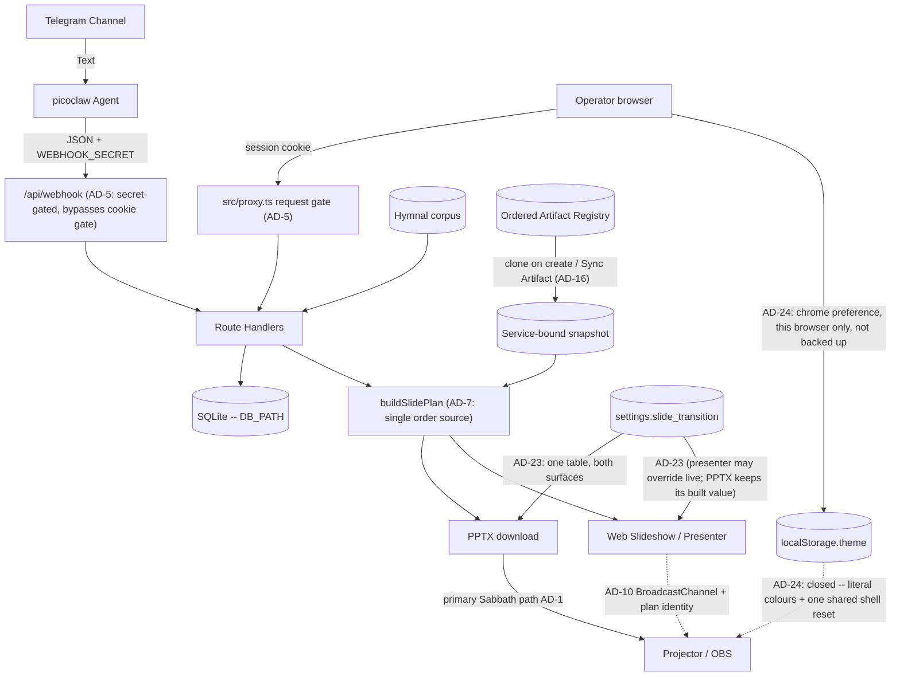
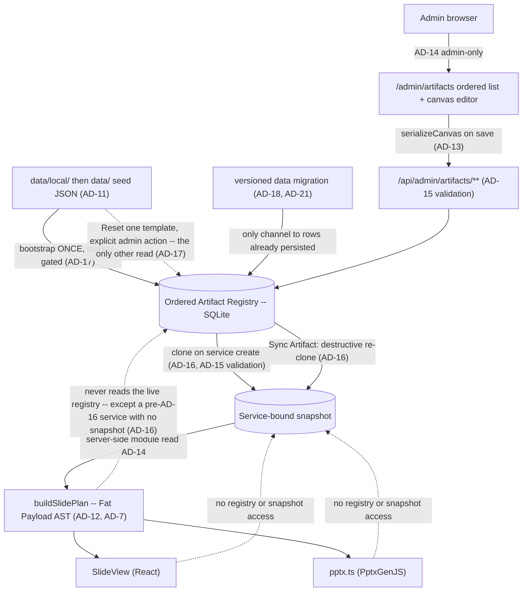

# Architecture Spine — BIC Worship Presentation Automation

**One spine per project.** This is the project's only architecture spine. The Epic 16 child spine was folded in on 2026-07-30 — see *AD map* below for the renumbering, and `../archived/architecture-epic-16/` for that run's memlog, case study, and review records (that folder was moved under `archived/` on 2026-07-30 so nothing sits beside this file looking like a peer spine).

## Design Paradigm

**Monolithic Next.js app (App Router UI + API routes)**
One deployable unit serves the operator Web Hub, JSON APIs (webhook/services), hymnal lookups, PPTX generation, web slideshow, presenter mode, and the admin Artifact Registry / canvas editor. Server Components are the default; `'use client'` is added only where hooks, browser APIs, or event handlers require it — including at the root, where one client provider wraps every route for theming without making the tree it wraps client-side (AD-24). Operators/agents follow `.claude/skills/picoclaw-webhook/` to POST the webhook JSON API (skill docs, not an in-process runtime). **Offline PPTX remains the primary Sabbath path**; in-browser slideshow / presenter are also shipped (FR-15 / FR-16).

**Within it: data-driven presentation rendering with a decoupled editor** (AD-11..AD-23). Slide layout is a JSON layout AST rather than hardcoded switch-statements; an uncontrolled canvas editor owns the design, and both renderers (React web, PptxGenJS) are dumb consumers of pre-hydrated ASTs. Epic 20 turns that registry from a template catalog into the **ordered** surface where the deck itself is authored.

## AD map — the 2026-07-30 fold-in

The Epic 16 spine numbered its own decisions from 1, so folding it in required renumbering. Old citations resolve through this table, and every affected `AD-n` heading below carries its former identity inline. `AGENTS.md`'s standing rule — never renumber an existing `AD-n` — was waived once, by the owner, for this merge only.

**What was repaired, stated precisely (corrected 2026-07-30):** the tracked planning, spec and story set. **Not the UX set** — `EXPERIENCE.md:153` still cites a bare `AD-4` for the clone/Sync reversal that belongs to `AD-14`, which is the very confusion AD-14's own text warns against, and it still states the superseded global-and-immediate rule as current design. That repair is owned by `bmad-ux` and is tracked at `epics.md:374`. Dated **run records** — readiness reports, review reports, the sprint change proposal — deliberately keep their contemporaneous citation form and were *not* rewritten, so several still use `INIT AD-n` / `epic-16 AD-n` or describe two live spines. An earlier version of this paragraph claimed every live citation in the repo was repaired; that was too strong, and the residue includes a case a dangling-reference check cannot catch: `sprint-change-proposal-2026-07-29.md:85` cites **bare** `AD-2..AD-5` in an epic-16 context, where those numbers now resolve to four entirely different decisions. Treat any `AD-n` citation in a document dated before 2026-07-30 as requiring this table before it can be read.

| Was | Now | Decision |
| --- | --- | --- |
| `epic-16 AD-1` | **AD-11** | Artifact Registry Storage |
| `epic-16 AD-2` | **AD-12** | Slide Plan Data Flow (Fat Payload) |
| `epic-16 AD-3` | **AD-13** | Canvas State Boundary |
| `epic-16 AD-4` | **AD-14** | Global Template Administration |
| `epic-16 AD-5` | **AD-15** | Stable Layout Identity |
| `epic-16 AD-6` | **AD-16** | Service-Bound Registry Snapshot |
| `epic-16 AD-7` | **AD-17** | The Seed Is a Bootstrap |
| `epic-16 AD-8` | **AD-18** | Vocabulary and Value Changes |
| `epic-16 AD-9` | **AD-19** | Cross-Boundary Binding Keys |

`INIT AD-n` was the old citation form for AD-1..AD-10 of this file. Those numbers did not change; drop the prefix. The fold-in also removes a real hazard: `AD-6` and `AD-9` each used to mean two different decisions depending on which document you were reading.

**Where AD-11..AD-19 were decided:** in `../archived/architecture-epic-16/.memlog.md`, listed above as a companion of record. This file's own memlog holds the fold-in and everything decided since; that one holds the nine decisions themselves, with the reasoning and the alternatives declined. A resume that reads only this memlog will not find them.

## Invariants & Rules

**Every `AD` carries a status tag, and the tag is part of the decision.** Without one, a rule written
in the indicative present says two different things — *this is how the code works* and *this is how the
code will work* — and a builder cannot tell which. The three tags:

| Tag | Means |
| --- | --- |
| `[ADOPTED]` | Decided **and** ratified against shipped code. The Rule describes `src/` as it is. |
| `[ADOPTED, partial]` | The mechanism ships, but a named gap remains. The gap is recorded in *Deferred*, never left for a reader to discover. |
| `[TARGET]` | Decided, **not yet built.** The Rule binds the story that builds it; its present tense describes intended state, and `src/` does not match it yet. |

A `[TARGET]` rule is no less binding than an `[ADOPTED]` one — the difference is only whether you can
verify it by reading the code today. AD-16..AD-22 land with Epic 20; everything else is shipped.

### AD-1 — Web Hub + Offline PPTX (Phase sequencing) [ADOPTED]
- **Binds:** Presentation rendering, Operator experience
- **Prevents:** Dependency on venue internet during Sabbath services
- **Rule:** Operators use a zero-install **Web Hub** for review/run-sheet. **Phase 1** presents on Sabbath from a downloadable offline **PPTX**. In-browser Web Slideshow / Presenter Mode are **shipped** (FR-15 / FR-16) but are **not** the hard offline Sabbath guarantee; PPTX download remains primary for venue reliability. A registry or layout change may not make Sabbath rendering depend on hub connectivity.

### AD-2 — Single Repository Monolith [ADOPTED]
- **Binds:** Code organization, deployment
- **Prevents:** Operational complexity and synchronization issues for a solo developer
- **Rule:** The picoclaw skill integration logic, API backend, and App Router web UI must reside in a single repository and be deployable as a cohesive unit. Registry storage, the admin editor UI, and both renderers are part of that unit; there is no separate editor service.

### AD-3 — Decoupled Ingestion and Presentation [ADOPTED]
- **Binds:** Data boundaries, external integrations
- **Prevents:** Tightly coupled integrations that would make replacing the Telegram/Agent ingestion difficult
- **Rule:** The API must expose a standard JSON interface for service generation that is agnostic to the input mechanism (Telegram/picoclaw). The presentation layer consumes this same API. Artifact templates are a presentation-layer concern; webhook/service intake JSON stays agnostic of layout templates.

### AD-4 — LiveServer durable paths (home PC production) [ADOPTED]
- **Binds:** Deployment, SQLite, announcement uploads
- **Prevents:** Ephemeral container-only data loss
- **Rule:** Production is deployed as one Docker/standalone unit on the home-PC LiveServer (`presenter.example.org` via Cloudflare Tunnel). Host-durable paths for `DB_PATH`, PPTX cache, and `UPLOADS_DIR` (compose bind-mounts). Operator details: `docs/deployment-guide.md` / `docs/deploy.md`. **As of 2026-07-30 no deployment exists** — the tooling ships and is configured, and nothing is running (`prd.md:540`, owner-corrected 2026-07-29). That date is load-bearing rather than trivia: AD-18's total-replacement licence and AD-21's released-version freeze both hinge on *until first deploy*, so they need an anchor stated here instead of inferred from this rule's tense. Announcement image refs are remote http(s) (SSRF-hardened) **or** hub-local `/api/uploads/<32-hex>.(jpg|jpeg|png|gif|webp)` resolved from disk for PPTX. Registry rows and per-service registry snapshots live in that same durable `DB_PATH`; editor image references resolve through the existing `UPLOADS_DIR` / allowlist rules, never new ad-hoc paths.

### AD-5 — Single request gate in `src/proxy.ts` [ADOPTED]
- **Binds:** every route and page; authentication and authorization
- **Prevents:** per-route authorization drift, and privilege that survives demotion, logout, or password change
- **Rule:** `src/proxy.ts` is the one request gate, and its `config.matcher` regex **is** the authorization boundary — anything it does not match is served with no session check at all, so a new exclusion ships together with its assertion in `tests/proxy-matcher.test.mjs` in the same change set. The gate re-checks every session against SQLite (deleted account, role demotion, stale `token_version`, revoked `sid`) and **fails closed** if that lookup throws. Privileged routes additionally call `requireSession` / `requireAdminSession`; the cookie's `role` claim is never trusted alone. `/api/webhook` is gated by `WEBHOOK_SECRET` only — 503 when unset, 401 when wrong or missing — never by a cookie. Post-login `next` targets pass through `safeNextPath`. Every gated response carries `Cache-Control: private, no-store` and `Vary: Cookie`, because the hub is published through a Cloudflare Tunnel where an edge cache rule could otherwise serve a rendered private page without the origin — and therefore without this gate — ever running. Do not export `runtime` from the Proxy file (Next throws), and do not reintroduce `middleware.ts`: a `proxy.ts` entry **always** runs on Node, while a `middleware.ts` entry is compiled for the Edge runtime **unless it exports `runtime = 'nodejs'`** — so the rename is what guarantees the per-request SQLite re-check rather than leaving it to a declaration someone can drop. (Node-runtime middleware has been stable since Next 15.5.0; the flat claim that `middleware.ts` *is* Edge is false, and a rule defended by a refutable reason is a rule that gets reverted. `src/proxy.ts:5-11` states it correctly.) **Two recorded deviations from upstream guidance, both deliberate.** Next's docs advise never relying on Proxy alone for authorization (`proxy.md:217-219`), so the nine non-admin routes carrying no in-route `requireSession` are a standing deviation rather than merely unfinished work — see *Deferred*. And Next advises avoiding a database check in this position for performance (`authentication.md`), which this rule requires on **every** gated request: accepted knowingly, because a signature-only check cannot see a deleted account, a demotion, or a revoked session, and for one congregation on a home server the cost of a local SQLite read is not the constraint the guidance assumes. If this hub ever serves traffic where it is, that is the trade-off to revisit — not the fail-closed behaviour. A Server Function POST inherits its route's matcher outcome, so a new matcher exclusion removes coverage from Server Functions on that path too.

### AD-6 — Optimistic concurrency on service edits [ADOPTED, partial]
- **Binds:** service mutation APIs, hub edit UI, agent/webhook corrections, registry template writes, Sync Artifact
- **Prevents:** an operator's edit silently erased by a late correction (last-write-wins)
- **Rule:** every service mutation carries the client's `updated_at` as a precondition; a stale value is rejected with HTTP 409 and the client re-reads before retrying. No write path may bypass the precondition. This covers registry writes and the **Sync Artifact** action of AD-16 — the shipped shape is `expectedUpdatedAt` / `RegistryStaleError` in `src/lib/registry/store.ts`.
- **The gap, named rather than left to be discovered (2026-07-30):** four shipped paths bypass it — the webhook correction and intake writes (`src/app/api/webhook/route.ts`), `DELETE /api/services/[id]`, and `PATCH`/`DELETE /api/announcements/[id]`, whose table has no `updated_at` at all. The rule is deliberately **not** narrowed to cookie-authenticated mutations to make this document self-consistent: the unguarded path is the *agent* path, which is precisely the late correction this decision's *Prevents* describes, so scoping the rule would abandon the hazard rather than record it. See *Deferred* for the closing work and for the second-granularity weakness in `updated_at` itself.

### AD-7 — `buildSlidePlan` is the only slide-order source [ADOPTED]
- **Binds:** PPTX generation, web slideshow, presenter + projector
- **Prevents:** divergent slide order or content between what the operator controls and what the congregation sees
- **Rule:** `buildSlidePlan` is the single source of slide order and content for every surface. No surface recomputes order from service fields or keeps its own ordering logic; a rendering or ordering change lands in the plan, never per-surface. AD-12's Fat Payload specializes this rule; AD-16 changes only where the plan reads its templates from, never that there is one order source.

### AD-8 — Image references resolve only through shared safety helpers [ADOPTED]
- **Binds:** announcement images, hub uploads, registry/asset references, PPTX embedding
- **Prevents:** a new surface reintroducing SSRF or unsafe content through its own laxer resolver
- **Rule:** image references resolve only through the shared helpers in `src/lib` — allowlisted remote http(s) and hub-local `/api/uploads/<32-hex>.(jpg|jpeg|png|gif|webp)` for announcements, and registry `/assets/...` refs for Artifact templates. A new reference vocabulary extends an existing helper or adds one alongside them with the same fail-closed default; no unit ships an inline resolver. The canvas editor introduces no second resolver and admits no `data:` or arbitrary remote URI.

### AD-9 — Schema evolution through startup DDL only [ADOPTED]
- **Binds:** SQLite schema, and the bootstrap path it shares with AD-18
- **Prevents:** two sources of schema truth between a developer machine and a fresh production container
- **Rule:** schema changes go through the app's startup DDL on the `getDb` path. No migration framework (Prisma or otherwise) is introduced without an explicit product decision recorded in this spine. Registry tables are created on that same path. **The bootstrap path is shared, and the division is fixed:** this rule owns *schema* — the shape, e.g. adding a column — while **AD-18** owns *value* migration — the contents, e.g. rewriting every row's `base_type`. Neither licenses the other's mechanism: a value change is not a reason to add a framework, and a schema change is not a reason to rewrite data.

### AD-10 — One presenter sync channel, client-side only [ADOPTED, partial]
- **Binds:** presenter, projector, web slideshow
- **Prevents:** a split sync topology where the projector follows one controller and ignores another
- **Rule:** presenter↔projector sync goes through the single `@/lib/present-channel` `BroadcastChannel` module; no surface opens its own channel name or message shape. No server realtime channel (WebSocket/SSE) is introduced unless product direction changes — keeping the venue path independent of hub connectivity, per AD-1. A registry edit must not add a second channel to push template changes to a live projector. **Every message carries a plan identity** — a fingerprint of the snapshot and resolved announcement set that produced the deck — and a receiver whose own identity differs **refuses to follow the index** and says so on the room-facing screen rather than rendering a slide it cannot vouch for. Presenter and projector are two independent `force-dynamic` renders, each calling `buildSlidePlan` at its own moment, so a bare `index` silently means different slides on the two screens the instant anything structural changes underneath them; since this rule forbids a surface inventing its own message shape, the identity has to live in the shared shape.
- **The gap (2026-07-30):** the plan-identity clause is `[TARGET]`. `PresentMessage` (`src/lib/present-channel.ts`) carries no identity field today, and the fingerprint is defined partly over AD-16's snapshot, which does not exist yet either. The single-channel rule above is `[ADOPTED]` and fully ratified; only the identity is unbuilt. See *Deferred* — the offset-slide hazard is live now, so this is not a wait-for-Epic-20 item by accident.

### AD-11 — Artifact Registry Storage *(was `epic-16 AD-1`)* [ADOPTED, partial]
- **Binds:** Database schema, the Canvas Editor's save API, and the startup seed path.
- **Prevents:** Data loss on ephemeral container filesystems, file-lock concurrency issues, and a seeder that overwrites administrator edits or leaks private seed content.
- **Rule:** The live Artifact Registry is stored in SQLite on the durable `DB_PATH` (AD-4). Filesystem JSON serves exclusively as a startup seed: startup inserts missing template IDs and **never** overwrites persisted administrator edits. Reset restores one selected template from that seed. The seed is two-layered — `data/local/default-registry.json` is git-ignored and **takes precedence over the shipped `data/default-registry.json` example whenever present**; a seeder that reads only the shipped example breaks the mechanism that keeps congregation data out of a public repository.
- **Superseded in part by AD-17 (2026-07-30):** the *"startup inserts missing template IDs"* clause only. Storage target, the two-layer seed precedence, Reset-from-seed, and "never overwrites administrator edits" all stand as written.
- **The gap in *"exclusively a startup seed"* (2026-07-30):** `src/lib/artifacts/registry-snapshot.ts:85-90` reads the seed at **plan-build** time and substitutes shipped content for any row the database does not hold — so today the seed is not exclusively a startup input, and a deleted template still reaches the deck. AD-17's extended read boundary is what closes this; until that lands, read this clause as `[TARGET]`. The two-layer precedence has one shipped override: `WPW_USE_SHIPPED_REGISTRY=1` inverts it (`seed.ts:39`) for tests and fidelity smokes, and nothing else may.

### AD-12 — Slide Plan Data Flow (Fat Payload) *(was `epic-16 AD-2`)* [ADOPTED]
- **Binds:** The `buildSlidePlan` return type and all downstream renderers.
- **Prevents:** The Web (`SlideView`) and PPTX renderers from performing independent database lookups or maintaining their own diverging layout logic.
- **Rule:** `buildSlidePlan` outputs a fully hydrated AST (Fat Payload) with exact rendering coordinates, fonts, colors, and resolved text content. Specializes AD-7: the plan is the single order *and* layout source, so a renderer never **reads data from** the registry itself. Importing a shared *helper* that happens to live under `src/lib/registry/` is not such a read — `pptx.ts` importing `isBundledAssetRef` from `registry/asset-safety` is the AD-8 resolver this spine requires, not a data path.

### AD-13 — Canvas State Boundary *(was `epic-16 AD-3`)* [ADOPTED]
- **Binds:** The React-Fabric integration layer (`src/components/admin/ArtifactEditor.tsx`).
- **Prevents:** Two-way data binding lag, stuttering drags, and unnecessary React re-renders.
- **Rule:** The Canvas Editor uses an Uncontrolled Wrapper pattern. Fabric.js owns the canvas state exclusively; React reads it **only on save**, through `serializeCanvas` over `canvas.getObjects()`, projecting into the registry's own element schema. Not `canvas.toJSON()`: Fabric's serialization format is **not** `ArtifactLayout.elements`, so a second editor surface built on `toJSON()` would fail AD-15's validator on every write. The projection into the registry schema is the boundary, not the canvas library's own format.

### AD-14 — Global Template Administration *(was `epic-16 AD-4`)* [ADOPTED]
- **Binds:** `/admin/artifacts`, `/api/admin/artifacts/**`, and the registry access layer.
- **Prevents:** Per-service template drift and operator-level mutation of every service's visual contract.
- **Rule:** Artifact templates are global across services. Registry management UI and APIs are admin-only and re-check the current account role from SQLite — a specialization of AD-5, not a separate authorization scheme. `/admin/artifacts` and `/api/admin/artifacts/**` are inside the AD-5 matcher, and adding a registry route outside it requires the same-change-set test update AD-5 demands. Downstream planners and renderers read the registry through server-side modules rather than the management API.
- **Superseded in part by AD-16 (2026-07-30):** the *"global across services"* clause only — a service now reads its own cloned snapshot. The admin-only authorization clause and the read-through-server-side-modules clause are **untouched** and still bind; the second now points at the snapshot instead of the live registry. Not to be confused with AD-4 (LiveServer durable paths), which is a different decision and is not affected.

### AD-15 — Stable Layout Identity *(was `epic-16 AD-5`)* [ADOPTED]
- **Binds:** Seed data, every write path into the registry, hydration, and both renderers.
- **Prevents:** Unit-specific renderer drift, required-placeholder deletion, and unsafe image references reaching a renderer through an unvalidated back door.
- **Rule:** Layouts use a fixed 16:9 canvas with normalized percentage coordinates and stable template/layout/element/placeholder IDs. Coordinates may extend beyond the canvas to preserve intentional source-deck clipping. **Every** write into the registry is untrusted and must pass the same structural and image-reference validation before persistence — the canvas save API, the startup seeder, and any import or asset-extraction script alike. Image refs validate through the shared helper required by AD-8; no write path ships its own check.

### AD-16 — Service-Bound Registry Snapshot *(was `epic-16 AD-6`)* [TARGET]
- **Supersedes:** the *"global across services"* clause of AD-14, and nothing else in it. Recorded as a separate decision so the reversal stays visible.
- **Binds:** service creation, the Sync Artifact action, `buildSlidePlan`'s template input, and every read path a service surface uses.
- **Prevents:** a live registry edit shifting the structure under a service an operator is preparing right now, and a weekly value entered against one structure being orphaned by a later structural change — and, in the other direction, a service with no way to be brought up to date.
- **Rule:** Creating a worship service **clones** the ordered live registry — order, kinds, labels, layouts, placeholder bindings, **and the administrator override records of AD-22** — into a **service-bound snapshot** on the durable `DB_PATH` (AD-4); creation is the only freeze event. The clone is of the *rendered* structure, so anything AD-22 keeps outside the layout travels with it; an override left out of the clone would either never reach the deck or reach it from outside the freeze, and both defeat this decision. A service's plan, Presenter, slideshow and PPTX read that snapshot; a live registry edit reaches an existing service **only** through the explicit **Sync Artifact** action, which replaces the snapshot destructively. Sync is permitted on **any** service, carries the service's `updated_at` precondition (AD-6), and may not alter the service's entered data (*State* convention) — "destructive" means it replaces the snapshot, never that it may overwrite a service someone else has moved underneath it. **Sync is a structural write and is therefore admin-only**, re-checking the role from SQLite exactly as AD-14 requires of every registry management surface, even though it is reached on a service route that `src/proxy.ts` gates for any signed-in account; its route ships with the `tests/proxy-matcher.test.mjs` assertion AD-5 demands and an in-route `requireAdminSession`. An operator may see that their snapshot is stale and *request* a sync; they may not perform one. Without this, "permitted on any service" and AD-14's surviving admin-only clause read as licence for an operator to freeze a half-authored layout into the service that presents in fourteen hours — this decision's own *Prevents*, arrived at from the other direction. The clone and the re-clone are write paths and validate under AD-15 like every other. **Announcement membership is not cloned:** the Announcements master list stays live and reaches an existing service at render time (CAP-7). **It is nonetheless scoped per service (`service_id`), matching the clone boundary everywhere else in this decision** — "not cloned" means this week's flyers may still change after the structure is frozen, never that one list is shared across services. The distinction is invisible while only one service is being prepared and decisive the moment two are open at once — a stale service reopened for a correction while next week's is being built — at which point an unscoped list bleeds one service's images onto another's deck. The shipped `announcement_items.service_id` is nullable, so both readings are currently expressible; this rule picks the scoped one. **A later structural change obliges nobody to keep an older snapshot renderable** — what the snapshot protects is the service's entered supporting data, not its ability to regenerate a past deck. The snapshot is the sequence *input*: `buildSlidePlan` remains the single source of order and layout (AD-7, AD-12), and no renderer reads a snapshot directly any more than it read the registry. **One bounded exception, stated as an exception rather than argued away — pre-existing services.** A service created *before* this model ships has no snapshot and renders from the live registry until its first Sync, which is a clone-in-place; from that moment the rule above governs it without qualification. So *"creation is the only freeze event"* holds for every service created under this decision, and the no-snapshot state is a **one-way migration path into** the decision rather than a second mode inside it: nothing may create a new service without a snapshot, and no code may re-enter the state once left. It is called out because every service in the database on day one is in it — `spec-artifact-registry-authoring/SPEC.md:88` assumed exactly this and an earlier draft of this rule forbade it, which would have left three stories free to answer it three ways. The Epic 20 data transition (AD-21) may instead clone a snapshot for every existing service and close the exception outright; that is the preferred landing, and either way the state is finite and dated. **Naming caution:** the shipped `RegistrySnapshot` type (`src/lib/artifacts/registry-snapshot.ts`) means *"the live-registry map assembled for one plan build"* — a different thing from this decision's per-service durable freeze, and the two must not be conflated when the second is built.

### AD-17 — The Seed Is a Bootstrap, Not a Correction Channel *(was `epic-16 AD-7`)* [TARGET]
- **Supersedes:** the *"startup inserts missing template IDs"* clause of AD-11, and — as of 2026-07-30 — the *"exclusively a startup seed"* clause too, which the read path already contradicts.
- **Binds:** the `getDb` startup path, the registry store's insert path, **every read path that assembles the registry**, the delete verb, the Reset verb, and the registry's ordering column.
- **Prevents:** an administrator's delete, rename or reorder being silently undone by an unrelated restart. A deleted row leaves no evidence behind, so anything that supplies "missing" IDs cannot tell *deleted on purpose* from *never existed here* — it resurrects the row forever.
- **Rule:** The seeder initialises data **from zero only** — first install, first run — and is gated by a marker in `settings`. It is never a gap-filler: after it has run, the administrator owns every row that exists, and the ordered registry is authored data rather than shipped data kept in sync. A gap in a database that already holds data travels as a versioned data migration (AD-18, AD-21), never as a re-seed. **The filesystem seed is read at exactly two moments — the first-boot bootstrap, and an explicit per-template Reset — and at no other.** In particular **no read path may substitute a seed template for a row the database does not hold, and none may substitute one for a row it holds but cannot parse.** An ordered registry of N rows produces a deck built from those N rows and no others; a template id the database does not hold does not exist, and a row whose payload will not validate **fails closed** — no layout, logged with the id and the reason, the same posture AD-5 and AD-8 already take. Both halves matter and the second is the easier one to leave open: `registry-snapshot.ts` substitutes seed content in **one** loop for absent and corrupt rows alike (`parseRow` merely returns `null`, so a corrupt row reaches that loop indistinguishable from a missing one), so a rule that closes only the *absent* case leaves shipped example content silently standing in for an administrator's real layout the moment one row is malformed. Closing only the boot door is what let a deleted slide re-materialise into the deck on every plan build, with `rejected.delete(seed.id)` suppressing even the log line. `tests/registry-reseed.test.mjs`'s assertion that a missing row is re-inserted is **inverted, not deleted**, and a second assertion pins that a deleted row does not reappear in a built plan. Restoring shipped content stays possible as an **explicit administrator action** — Reset-from-seed per template, per AD-11 — never as a side effect of a restart, and never as a bulk re-seed of a live database.
- **An authored row has no seed, and is validated against itself.** The stability baseline for a save is the row's currently persisted state; the shipped seed is a baseline only for rows the bootstrap wrote. A row with no seed origin therefore **exposes no Reset** — Reset is defined only where shipped content exists to restore — and the registry records, per row, whether it originated from the bootstrap or from an administrator, because three verbs (save validation, Reset, and any future re-seed) all need that answer and none can infer it. Without this, the shipped `assertStableAgainstSeed` path answers a brand-new General with `404 Unknown template` on a row the administrator is looking at, and Story 20.4's *"a rejected Save names the property"* cannot be met, because the failure is not about a property.

### AD-18 — Vocabulary and Value Changes Travel as Explicit One-Time Migrations *(was `epic-16 AD-8`)* [TARGET]
- **Superseded in part by AD-21 (2026-07-30):** the *"marker-gated"* mechanism clause only — one version counter replaces the per-change boolean. Everything else stands: values reach persisted rows only through an explicit migration on the startup path, and no framework arrives with it.
- **Binds:** the `base_type` value set, `READ_ONLY_BASE_TYPES` / `EDITABLE_BASE_TYPES`, the registry validator, and any future change to persisted registry values.
- **Prevents:** a shipped vocabulary change reaching persisted rows through boot-time re-seed (which AD-17 removed) or not reaching them at all — and the opposite failure, a migration framework arriving by the back door.
- **Rule:** AD-9 fixes *schema* evolution on the startup DDL path and is silent on **value** migration; this decision fills that silence rather than weakening it. A shipped change that must reach rows already persisted travels as an **explicit, one-time migration** on the startup path, versioned per AD-21. It is not a migration framework and AD-9's prohibition stands: no Prisma, no versioned migration directory, without an explicit product decision recorded in this spine. **Until first deploy** no production rows exist, so Epic 20's seven-`base_type`-to-three-kind collapse ships as a **total replacement** — no backward compatibility, no migration over live rows — folding into production data version 1 (AD-21); at first deploy that licence ends, and the same change would need a migration over live `artifact_templates` rows. A migration operates on the **live registry** and does **not** rewrite service snapshots — structure reaches an existing service only through Sync Artifact (AD-16), so a migration that rewrote snapshots would be a second structural channel. An older snapshot may therefore stop being renderable, which AD-16 accepts; what must survive is the **entered data**.
- **A value persisted in more than one place has exactly one authoritative copy, and it is named here:** the row's `payload` JSON is authoritative for every template field, and any column duplicating a payload field — `label`, `base_type`, and any slot discriminator — is a **derived index** maintained by the same write. A value migration therefore rewrites the payload and re-derives the columns **in the same statement**, and a migration that writes a column alone is refused by a test asserting column and payload agree for every row. This is not pedantry about storage: the admin list reads the column (`store.ts:74-92`, and derives `editable` from it) while the plan and the editor read the payload (`store.ts:35-38`, `registry-snapshot.ts:41-64`), so a column-only migration leaves the administrator's screen and the congregation's screen disagreeing about what kind every row is — with nothing logged and nothing to 409.

### AD-19 — A Cross-Boundary Key Is a Server-Owned Value the Administrator Cannot Edit *(was `epic-16 AD-9`)* [TARGET]
- **Binds:** the `base_type` enumeration, the four predefined SongSet slots, the Placeholder Catalog key set, the worship-service settings form, and every write path into the registry.
- **Prevents:** two independently-built units agreeing to disagree about a key — the registry surface and the worship-service settings form picking different handles for the same SongSet slot, and the canvas editor's insert list drifting from what the validator actually admits.
- **Rule — the kind vocabulary and the SongSet slot key:** the kind vocabulary is exactly the three the SPEC fixes — `general`, `song-set`, `announcement`. `text-placeholder`, `image-placeholder`, `mix-placeholder` and `fullscreen-image` are **gone rather than renamed**: a placeholder stops being a kind and becomes an element inserted onto a General from the Placeholder Catalog. Only `song-set` expands, into four slot identities — `songset-bt-open`, `songset-bt-close`, `songset-ds-open`, `songset-ds-close` — and that identity **is** the key the worship-service settings form binds a hymnal number to. `song-set` names the kind, never an entry: an entry carries one of the four slot identities. **The recognized set is therefore closed and complete** — `general`, the four `songset-*` slots, `announcement`: six keys over three kinds, and no write path admits a seventh. Reordering rows changes the presented sequence (CAP-8) without touching a binding; renaming a label cannot touch one either. Three requirements make the scheme unambiguous rather than merely convenient: the slot identity is **never administrator-editable**, **at most one registry row may carry each slot identity**, and the identity is a **semantic name, never an ordinal** (`songset1` re-imports the positional reading this decision exists to remove). The chosen spelling is a persisted binding key, so changing it later is the versioned data migration AD-18 and AD-21 govern. A binding whose slot row has been deleted is **inert**, not an error: the slot does not appear, because the administrator removed that song from the order — and the entered hymnal number survives in the service's own data, which AD-16 requires regardless. Extending the vocabulary — a fifth slot, a fourth kind — is a code-plus-tests change, never administrator configuration.
- **Rule — one home for the value the key names:** a weekly value a slot binding names has exactly **one persisted home**, and it is the service's own entered data; the slot identity is a *key into* that data, never a second copy of it. The four `songset-*` identities therefore **replace** the shipped ordinal field names `song1Number..song4Number` (`worship-form-fields.ts:6-9`, mapped positionally at `parsed-fields.ts:418-421`) in the same change set that introduces them — deleted, not aliased — and no code path may hold a hymn number `buildSlidePlan` does not read. Otherwise a webhook correction (which AD-3 forbids knowing slot keys) rewrites one home while the settings surface owns the other, and the deck renders 245 while the run sheet and the edit form both show 312, with no 409, no log, and no screen on which both values appear.
- **Rule — the closed set is a statement about the registry, not about the rundown:** a hymn in the service's entered data that no slot identity claims is **surfaced, never silently dropped and never fatal**. `buildSlidePlan` emits no slide for it and the service surface reports it as unclaimed weekly data. The mapping from each `songset-*` identity to its position in the parsed rundown is fixed in **one table in one module**, because the shipped planner renders an unbounded number of middle Divine Service songs (`slide-plan.ts:399`, `:464-466`) and reads the closing song as the last element while the shipped form maps `song4Number` to the second — two defensible readings of the same four slots, which with three hymns are different songs.
- **Rule — Placeholder Catalog:** the admitted key set is server-side vocabulary enforced on **every** write path, the same treatment AD-8 and AD-15 gave image references, so *"the UI cannot invent a catalog key"* (CAP-4) is a property of the registry rather than of one client. Its key spelling is persisted into saved layouts, so that spelling too falls under AD-18 and AD-21 once chosen. Independent of the SongSet clause above. **The catalog is one server-side module holding both the admitted key and its resolver** from the parsed rundown — so a key cannot be admitted without a filler, and CAP-4's *"the same catalog key on multiple Generals with different styling"* is key-addressed rather than call-site-addressed. Today the planner supplies values as hardcoded literals at ten separate call sites in `slide-plan.ts`, spelled differently from `placeholder-catalog.md`; a catalog that fixes only the write side admits a key nothing can fill, and `hydrate.ts` fails closed on a required binding — on a Sabbath. That resolver map is the one map the planner still legitimately owns, and AD-20's prohibition does not reach it. Nothing named `ALLOWED_PLACEHOLDER_KEYS` exists for this purpose: the shipped constant of that name is an unrelated object-key whitelist, and the resemblance makes a grep look like confirmation.

### AD-20 — The Planner Injects Nothing the Registry Did Not Ask For [TARGET]
- **Binds:** `buildSlidePlan`, the registry seed, the ordered registry, and every liturgical rule about which slides exist.
- **Prevents:** a liturgical decision requiring a code change and a deploy, and the planner keeping a second, invisible source of deck content alongside the registry.
- **Rule:** every slide in the deck originates from an ordered registry entry. `buildSlidePlan` **applies** rules; it does not **hold** them. Fixed liturgical content — the standing responses `#671` and `#684`, the closing *We Have This Hope* — is authored as **General** entries and edited by hand, never injected by the planner and never computed from the hymnal. Because a General generates no title slide, the `skipTitle` mechanism is **removed rather than migrated**: there will be nothing left to suppress. It ships today at five sites (`slide-plan.ts:140`, `:148`, `:438`, `:460`, `:550`) and Story 20.1 deletes them — a removal, not a compatibility shim. Changing or adding a liturgical song is a registry edit.

### AD-21 — Persisted Data Carries One Version Number, and Unreleased Transitions Compact Into One [TARGET]
- **Supersedes:** the mechanism clause of AD-18 — the per-change boolean marker, precedent `artifact_seed_hash_backfilled`. AD-18's rule that persisted rows change only through an explicit migration, and its prohibition on a migration framework, stand untouched.
- **Binds:** the persisted data version in `settings`, every data migration on the `getDb` startup path, the release procedure, and the developer database lifecycle.
- **Prevents:** two builders keying the same change incompatibly — one adding a per-change boolean, another bumping a counter — and a production database accumulating one transition per code change, so that its version history tracks development activity instead of releases.
- **Rule:** All persisted data shares **one monotonic version number** in `settings` — one counter for the whole database, never one per table or per domain, so that "which version is production on" has a single answer. A change that must reach data already persisted is declared **explicitly while it is being coded**, as the transition from version *n* to *n+1*; it is never inferred at deploy time. **An unreleased transition is not yet history and may be rewritten:** the whole batch of unreleased transitions is compacted into a single transition before it reaches production, and developer databases are **reset** to the compacted version rather than migrated through the steps it replaces. **A released version is frozen** — once a version has reached production it is never renumbered, re-cut, or folded into another. Small steps are a development convenience and stop at the merge; production sees one transition per release. AD-17's seeding marker and this counter are **distinct**, and neither substitutes for the other: the marker records that bootstrap ran, the counter records which data version is persisted. This is a counter and a convention, not a framework: AD-9's prohibition stands.
- **The counter's absence is not version 0.** A database created by the AD-17 bootstrap is stamped with the current data version **by the bootstrap itself, in the same transaction as the seeding marker**, and declares itself already migrated; a database holding registry rows and no version key is a *pre-counter* database and takes exactly one recorded repair transition. Because this decision insists the marker and the counter are distinct, nothing else would make writing the counter anybody's job on a fresh install — and a fresh install that reports version 0 re-runs history it was never part of.
- **The order on the `getDb` path is fixed, and asserted by a test:** startup DDL (AD-9) → data migrations (AD-18) → first-boot bootstrap (AD-17). A migration never observes rows the bootstrap wrote in the same boot. Left unstated, the reverse order is equally compliant and strictly worse: the Epic 20 collapse, whose mapping table is keyed on the seven retired `base_type` values, would run *over freshly seeded `songset-*` rows* and either refuse to boot — at 08:40 on a Sabbath — or fall through to a default that rewrites all four slots to `general`, destroying AD-19's one-row-per-slot uniqueness by migration and dropping three songs from the deck.
- **`schemaVersion` is not this counter and never answers for it.** The per-row payload discriminator (`types.ts:83`, pinned at `validate.ts:449-450`, re-stamped at `:505`) describes the *shape* of one template and a transition may raise it; *"which version is production on"* has exactly one answer and it is the `settings` counter. A change that bumps one without deciding about the other is the ambiguity this decision's *Prevents* names, one level further in than it first looked.

### AD-22 — Authoring Authority Is Fixed per Kind: Free Canvas, Bounded Config, or Bound to a Set [TARGET]
- **Binds:** the canvas editor, the SongSet configuration surface, the registry validator, and the plan's expansion of one entry into N slides.
- **Prevents:** the canvas editor and the validator disagreeing about what an administrator may author on a non-General entry — one opening a free canvas on a SongSet row and admitting an extra or rebound placeholder, the other refusing it — and CAP-3's *"General only"* living nowhere but in a capability statement.
- **Rule:** authoring authority is fixed per kind, and no surface widens it. **`general` is free canvas:** the administrator composes it from anything, including Placeholder Catalog keys (AD-19). **A `songset-*` row gets a bounded configuration surface, not a canvas:** exactly two background images — one for its title layout, one for its lyric layout, which verse and refrain share — plus font style and font size. Both background references resolve through the shared helper AD-8 requires: this surface is not the canvas editor and introduces no second resolver of its own. Layout composition itself is developer-owned seed data and is not exposed there; it stays registry data hydrated into the plan (AD-11, AD-12), never a coordinate held by a renderer. **Administrator-configured values persist outside the layout**, as an **override record keyed by row and field**, re-applied over the developer layout at hydration: the layout JSON stays developer-owned in full and a migration may replace it wholesale, the override record stays administrator-owned in full and no migration, Reset, or re-seed writes it, and a bounded surface that writes *into* the layout is refused by the validator on every write path (AD-15). An earlier draft left the encoding as "a schema call, not an invariant" — an override record beside the layout *or* a marked field inside it. The two were never equally available: the shipped validator rejects unknown keys against a closed `ALLOWED_LAYOUT_KEYS`, so the in-layout marker cannot ship without a registry-contract change this decision does not authorise, leaving only the unmarked shape — background written straight into `layouts.*.backgroundImage`, font into element `style`, indistinguishable from developer output. Then this decision's own migration clause replaces those layouts and **every background and font size the administrator chose reverts to the shipped default, on all four slots, silently, before anyone opens the hub** — AD-11 keeps no second copy and Reset would discard them too, so the only record of them was the layout just overwritten. The row's placeholder set and its SDAH slot binding are server-defined: nothing may be added, removed or rebound, and the validator refuses it on every write path (AD-15). **An `announcement` row is bound to the Announcements master set**, whose membership is not registry-authored at all (AD-16, CAP-7). Only those two kinds **expand** — a SongSet row into its title and lyric slides, an `announcement` row into N full-bleed images; a General is one slide. Because AD-17 reads the seed once, a developer's later change to a SongSet layout reaches a deployed database only as a versioned data migration (AD-21) — never by restart, and not by Reset. **Reset restores the shipped *layout* and leaves the override record untouched**, which is the whole point of keeping the two apart: before the override record existed, Reset would have discarded the administrator's backgrounds and font sizes along with the layout, and there would have been nowhere to recover them from. A Reset that also cleared administrator configuration would need to say so and does not.

### AD-23 — Transition Style Is One Value, Described Once, Consumed Identically [ADOPTED]
- **Binds:** PPTX generation, web slideshow, presenter, projector, the admin settings surface
- **Prevents:** a deck that fades in PowerPoint and cuts on the projector — the same slide sequence behaving differently on the two surfaces the congregation and the operator each watch
- **Rule:** transition style is **one app-wide value** in `settings` (`slide_transition`), and each style is described **exactly once**, in `src/lib/transitions.ts`, carrying both its PowerPoint element and its browser animation parameters. Neither renderer holds either half: `pptx.ts` and the browser surfaces all import that table, and **no surface keeps a default of its own** — that, not immutability, is the invariant. The value reaches each surface directly from `settings`, never through the plan (`buildSlidePlan` has no transition concept at all). There is no per-service override. The presenter **may** override the style for the **live browser session**, and that override travels through AD-10's channel so presenter and projector never disagree with each other (`PresenterOperator.tsx`); a PPTX already generated keeps the `settings` value it was built with, because a downloaded file cannot be re-styled after the fact. Adding a style means adding a row in that one table — and only styles that survive a plain `<p:transition>` child without the `p14` extension namespace qualify, so nothing silently degrades to "no transition" when the deck is opened elsewhere. This ratifies a convention the code already states in its own header; it is recorded here because FR-7 (`prd.md:305`) makes it a requirement and `docs/architecture.md:61` — a declared source of this spine — already contradicts it by hardcoding a crossfade.

### AD-24 — Operator Chrome State Is Browser-Local, and the Room-Facing Surface Is Closed to It [ADOPTED, partial]
- **Binds:** the root layout's client boundary, every browser-persisted operator preference, the choice between `settings` and `localStorage` as a storage target, and every full-screen room-facing surface
- **Prevents:** one hazard with three faces — a preference landing in `settings`, where it silently becomes *every* operator's, or a deck-affecting value landing in `localStorage`, where AD-4's durability, AD-6's concurrency and AD-18/AD-21's migration rules cannot reach it; the root client boundary migrating upward until the whole app is a client tree; and a client-persisted value that **paints** becoming a third structural channel to the congregation's screen, alongside `buildSlidePlan` (AD-7) and the BroadcastChannel (AD-10)
- **Rule — three tiers, and the question that picks one.** **Application** state — anything the product decides to remember — reaches one of three homes, and *who must agree on it* decides which. **Persisted-shared** lives in SQLite on the durable `DB_PATH` (AD-4), an app-wide value in `settings`, as AD-23 already does for `slide_transition`. **Persisted-local** lives in that browser's `localStorage` and nowhere else: not in SQLite, not under `DB_PATH`, and therefore **not backed up**. **Ephemeral-shared** is not persisted at all and travels over AD-10's channel, which is what AD-23's live presenter override already does. `slide_transition` is in `settings` because both renderers and both screens must agree on it; the theme is in `localStorage` because nothing but this operator's own eyes depends on it. The tiers are not interchangeable in either direction — a preference in `settings` becomes every operator's, and a value the deck depends on in `localStorage` sits outside every durability, concurrency and migration rule this spine has. `next-themes` owns the `theme` key and the `attribute="class"` contract that `globals.css:5`'s `@custom-variant dark (&:is(.dark *))` is keyed on; a second browser-persisted preference extends that mechanism rather than standing one up beside it.
- **The session cookie is not a fourth tier, and saying so is what keeps it from becoming one.** `src/lib/auth/session.ts` persists a signed session cookie in the browser, which is why the clause above says *application* state rather than *persisted* state. That cookie is **credential transport governed by AD-5**, not a place to keep application state, and the distinction is load-bearing rather than pedantic: a cookie is the one browser-persisted home the **server** can read, so moving a chrome preference there — the standard fix for a first-paint theme flash — would hand a room-facing server render access to operator chrome and quietly demote the closure below from *structural* to *enforced*. A chrome preference does not go in a cookie.
- **Persisted-local holds a view preference and nothing else.** No registry payload, no service data, no unsaved domain draft — `localStorage` is outside AD-15's validation, AD-6's precondition and AD-21's counter, all three of which are defined over SQLite and cannot follow a value into a browser. The *who must agree* question alone does not catch this, because the honest answer for an unsaved draft is *nobody yet*: Story 17.4's canvas dirty-state guard is the live instance, and an `ArtifactLayout` parked in `localStorage` would pass every word of the tier test while escaping the entire registry write contract. Unsaved editor state stays in memory, per AD-13.
- **`localStorage` is a cross-window channel, and that does not make it AD-10's.** Writing a key fires a `storage` event in every other same-origin window, so persisted-local propagates between windows without opening a `BroadcastChannel` or inventing a message shape — which means it slips past both of AD-10's prohibitions while doing AD-10's job. Presenter↔projector coordination — anything one surface writes so that *another surface* will act on it — travels over AD-10's channel and carries its plan identity. Persisted-local is for state a browser keeps for **itself**; that it happens to reach a sibling window is a property to contain, never a transport to use.
- **Rule — the client boundary mounts at the narrowest layout that covers its consumers, and never on `layout.tsx` itself.** `src/app/layout.tsx` stays a Server Component; today it reaches the client through one child, `src/components/ThemeProvider.tsx`, which is at the root because theming's consumers are every route. **Passing `children` through a client provider does not make them client components** — they are server-rendered and arrive as an already-rendered tree — so the paradigm's *Server Components are the default* survives this provider and would survive another. That is stated rather than assumed because both wrong readings cost something: a reader who thinks the boundary is contagious concludes the app went client-side in Story 17.1, and one who thinks it is free puts app state at the root. The test for a new provider is **decidable rather than a matter of taste — enumerate its consumers and mount at the narrowest layout that contains all of them.** Root is the answer only when that enumeration is *every route*, and "it is simpler at the root" is not that enumeration. What must never happen is the boundary moving **upward**: `'use client'` on `layout.tsx` converts the whole app, and no provider requires it — a provider that seems to need it needs a narrower mount instead. `<html>`'s `suppressHydrationWarning` is part of this boundary rather than incidental markup: next-themes writes the class before React hydrates, so the attribute mismatch is expected by design.
- **Rule — the room-facing surface is closed to operator chrome, and a test is what keeps it closed.** The projector, the web slideshow and the PPTX never read operator chrome state, in any form, under any setting — the constraint AD-1 and FR-20 already imply, which AD-12's Fat Payload makes *possible* by resolving every colour into the plan, and which nothing enforced until Story 17.1. Three mechanisms, each carrying a share the others cannot: the projected render tree paints in **literal colours**, carrying no theme token and no theme-coloured edge (`ArtifactSlide` resolves every colour from the registry through inline `style`, falling back to literals — `#FFFFFF`, `#000000`, `transparent` — never a token); a full-screen room-facing **client** surface **neutralises the app shell it inherits** — `html`/`body` background, `overflow`, and `scrollbar-gutter` — through the one shared hook `src/lib/use-projected-shell.ts` and never its own copy; and `tests/theme-chrome.test.mjs` is the gate, with **two** sets that must both be maintained — `PROJECTED` for the token, edge and closure guards, `FULL_SCREEN` for the shell reset — so a new room-facing surface joins whichever of them applies **in the same change set**, exactly as AD-5 requires of a new matcher exclusion. Every write into that tree validates under AD-15 like any other. The PPTX is closed *structurally* rather than by enforcement — it is generated on the server and cannot read browser state at all — which is why the enforcement above names only the browser surfaces.
- **Why the shell clause is separate from the token clause, and where it is still open (2026-07-31).** Both halves trace to one mechanism: `globals.css` paints `body` with the theme background and reserves `scrollbar-gutter: stable` on `html`, so a `fixed inset-0` surface sizes to the viewport *minus* that gutter and the shell shows as a strip down the edge of the projected screen. A token scan cannot see it, twice over — the class that arms the gutter is a **width** utility carrying no token name, and the paint lands on `html`/`body`, outside any client tree a component-level check can enumerate, which is why Story 17.1's first verification pass was thorough inside exactly the wrong boundary. Permanently white was wrong but not *variable*; the moment a theme existed that strip followed the operator's choice **live, mid-service**. **The gap:** the clause says **client** surface because a React hook cannot run in a Server Component, and the two room-facing **route shells** are Server Components — `projector/page.tsx:71` and `slideshow/page.tsx:76`, the branches a `buildSlidePlan` throw renders. Both paint `bg-black` on their own element and carry no theme token, so the token half holds; neither resets `html`/`body`, so the strip is live there, and `FULL_SCREEN` lists only the two Clients so nothing catches it. Deliberately **not** resolved by narrowing the rule to *client surfaces are closed* — the surface a registry failure puts in front of the congregation is precisely the one this decision exists to protect. See *Deferred* for the closing work.

  **Owned by Story 17.7 — *The Room-Facing Shell Belongs to the Route, Not to the App*.** That is the key that takes this decision from `[ADOPTED, partial]` to `[ADOPTED]`, and it is named here because a partial tag with no owner is a dead end: the gap was filed on 2026-07-31 with no key at all. The owner chose the route-group layout on 2026-07-31 — one layout owning every room-facing URL, with `FULL_SCREEN` widened to it — from the three candidates in *Deferred*. Story 17.1 closed the token half and is scoped in writing to it; nothing else in Epic 17 depends on this. Code review round 2 then found the gap is **four holes, not the one recorded above** — the first server paint on every projected load, the two Server-Component error branches, `notFound()` at six reachable sites with no `not-found.tsx` anywhere in `src/`, and `PROJECTED` being closed downward but never upward — all four the same defect at different depths, which is what decided the shape. Note for whoever implements it: `useLayoutEffect` is not a shortcut, because the paint that leaks is the **server's**; the closure has to be CSS or a server-emitted class.

  *(Recorded 2026-07-31 by `bmad-dev-story` as a citation repair, not an amendment: no clause changed, no `AD-n` added, nothing renumbered. The decision and its gap were already here — what was missing was the key that owns the gap.)*
- **The two surfaces that pin `.dark` on their own wrapper are operator surfaces, not room-facing.** `PresenterOperator.tsx` and `SlideGridDialog.tsx` — both under `src/app/services/[id]/present/`, not `src/components/` — opt out of the operator's choice deliberately and win for their own subtree. That is not a violation of this rule, and this rule does not license removing those wrappers.

## Consistency Conventions

| Concern | Convention |
| --- | --- |
| Naming (entities, files) | kebab-case for directories/files, PascalCase for components, camelCase for variables/functions. |
| Data & formats | API responses use standard JSON envelopes (`{ error: string }` + explicit status on failure). Dates stored and transmitted in ISO 8601 UTC. |
| State | A service's **entered data is historical**: only that service's own mutation path changes it — an operator form edit (FR-11) or an authorized webhook correction (FR-12) — and never as a side effect of anything else. No registry edit, no **Sync Artifact**, and no value migration may alter a service's stored form input. Structure is the opposite: a service adopts a clone of the Artifact Registry at creation, and live structure reaches it only through Sync Artifact, permitted on any service (AD-16). A service is **not** required to regenerate a byte-identical deck later — what is kept is the entered data, not the rendering. Concurrent overwrite is arbitrated by AD-6's `updated_at` precondition, never last-write-wins. |
| Client state | Application state gets three homes, and *who must agree on it* picks one (AD-24): **persisted-shared** → SQLite on `DB_PATH`, app-wide values in `settings`; **persisted-local** → that browser's `localStorage`, view preference only, not backed up; **ephemeral-shared** → AD-10's `BroadcastChannel`. A value the deck, another operator, or another surface depends on is never persisted-local, and no domain data goes there at all. Room-facing surfaces read **persisted-local never** — they do read `settings` (AD-23's `slide_transition`) and the channel. The AD-5 session cookie is credential transport, not a fourth home. |
| Boundaries | Route handlers stay thin; parsing, PPTX, auth, images, announcements, and DB access live in `src/lib/*`. Registry **storage and validation** live in `src/lib/registry/*`; registry **hydration and the runtime contract** — the Fat Payload of AD-12 and the shape AD-15 enforces at render time — live in `src/lib/artifacts/*`; the service-mutation paths that carry AD-6's precondition live in `src/lib/services/*`, and the registry's own precondition (`expectedUpdatedAt` / `RegistryStaleError`) in `src/lib/registry/store.ts` — one rule, two enforcement sites, and a third must not appear. Those two sites signal a stale write differently (a returned result vs a thrown error); a new write path adopts the shape of the layer it lives in rather than inventing a third. None of these belongs in a route handler. better-sqlite3 is synchronous and server-only. |
| Testing | `node:test` with `--experimental-strip-types`, resolved through the loader `tests/register-ts-resolve.mjs`, over an **explicit file list** in `package.json` `scripts.test`. A new suite is registered in that list **in the same change set** — an unregistered test file never runs, locally or in CI, and nothing detects the omission. No second runner without a decision recorded in this spine. This convention is here because AD-5, AD-15 and AD-17 each delegate their enforcement to a suite the spine otherwise never described. |

## Stack

| Name | Version |
| --- | --- |
| Node.js | **22.x (`>=22.12`)** — what `Dockerfile` and CI already run. Node 20 reached **EOL 2026-04-30**; Next 16.2.10 requires `>=20.9.0`. Note 22 is now *Maintenance* LTS and 24 is *Active*, so the same reasoning that retired 20 will retire this row — see *Deferred* |
| Next.js | 16.2.10 (App Router, `output: "standalone"`) |
| React / React DOM | 19.2.4 |
| TypeScript | ^5 (strict) |
| Tailwind CSS | ^4 |
| better-sqlite3 (SQLite, WAL) | ^12.11.1 |
| pptxgenjs | ^4.0.1 |
| jszip | ^3.10.1 |
| fabric | ^6.6.1 (canvas editor) |
| @base-ui/react (the primitive library under shadcn base-nova) | ^1.6.0 |
| shadcn | ^4.13.0 — a **runtime** dependency, not just a generator: `globals.css:3` does `@import "shadcn/tailwind.css"`, so it feeds the same palette file AD-24 cites. Listed on its own row because the `@base-ui/react` row above used to name shadcn while pinning a different package's version, which made an auditor read this as already covered |
| next-themes | ^0.4.6 (resolved `0.4.6`) — earns a row because AD-24 rests on it: it owns the `localStorage` key *and* the `attribute="class"` contract the `.dark` palette is keyed on. Web-verified 2026-07-31: `0.4.6` **is** the latest release (2025-03-11), so this row is both undrifted and at head — see *Deferred*, because that is not the same as active |
| ESLint / eslint-config-next | ^9 / 16.2.10 |
| fast-xml-parser | ^5.10.1 (dev — the parser inside the enforced privacy filter, `scripts/extract-pptx-assets.mjs`) |
| Test runner | `node:test` + `--experimental-strip-types` (no vitest/jest — see *Testing* above) |

`package.json` pins every library row and this table mirrors it — last mirrored 2026-07-30, zero drift. **Two things that mirroring does not cover, stated so their absence is not read as a clean bill:** the Node.js row has no `engines` field to mirror *from* (adding one is tracked in *Deferred*), and drift-vs-`package.json` says nothing about currency-vs-upstream — four rows now sit a major behind (see *Deferred*). Storage target, PPTX generator, and canvas library are fixed — the registry adds no parallel mechanism.

## Structural Seed

System-level dependency direction. The `Service-bound snapshot` node and its two inbound edges are
**Epic 20 target** (AD-16); everything else in this graph ships today.



Registry detail — read *through* the plan, never by a renderer, and never through the management API.
**This graph is the Epic 20 target** (AD-16..AD-22): today there is no per-service snapshot and
`buildSlidePlan` reads the live registry directly.



```text
worship-presenter-web/
  src/proxy.ts       # THE request gate (AD-5). Not middleware.ts -- Next 16, always Node runtime
  src/app/           # App Router UI + API routes (hub, webhook, services, slideshow, presenter, announcements, login, admin/artifacts)
  src/lib/           # parser, pptx, slide-plan, lyrics, db, images, uploads, scripture, transitions (AD-23), auth/, present-channel
                     #   + use-projected-shell.ts -- the ONE app-shell reset every full-screen room-facing surface calls (AD-24)
  src/lib/registry/  # registry storage + validation (AD-11, AD-15); asset-safety is the AD-8 helper
  src/lib/artifacts/ # hydration + runtime contract: the AD-12 Fat Payload, registry-snapshot, render/preview models
  src/lib/services/  # service mutation paths -- the only home of AD-6's updated_at precondition
  src/components/    # Header, SlideView + admin/ArtifactEditor.tsx (the AD-13 canvas editor)
                     #   + artifacts/ArtifactSlide.tsx (the AD-12 renderer -- NOT the editor) + ui/ shadcn
                     #   + ThemeProvider.tsx -- the ONE root client boundary (AD-24) -- and ThemeToggle.tsx
  public/            # bundled registry assets: the /assets/... resolution root (AD-8)
  data/              # hymnal corpus (hymns.json); default-registry.json seed; asset-map.json; SQLite via DB_PATH
  data/local/        # git-ignored private seed overrides (preferred over the shipped example)
  data/uploads/      # default UPLOADS_DIR (durable host volume in LiveServer prod)
  tests/             # node:test suites incl. proxy-matcher, public-repo-guard, asset-map-evidence, theme-chrome (enforced gates)
  docs/              # deployment-guide, deploy, cloudflare-tunnel, PRIVATE-DATA
  .constitution/     # hard repository rules (public-repository.md)
  Dockerfile / docker-compose.yml  # LiveServer prod/dev profiles (standalone)
  scripts/           # import-hymnal, import-kjv, registry-doctor, extract-pptx-assets, auth + smoke helpers
  .claude/skills/picoclaw-webhook/  # agent skill docs for webhook intake/readback (FR-1); not a runtime server
```

## Capability → Architecture Map

Present because two specs drove this spine. Read the right-hand column downward: a capability with no governing decision is a hole, and this table is where it shows.

**Epic 20 — `spec-artifact-registry-authoring`**

| Capability | Lives in | Governed by |
| --- | --- | --- |
| CAP-1 — one ordered registry defines which slides exist and in what sequence | `src/lib/registry/*` → `buildSlidePlan` | AD-7, AD-16, **AD-20** (the planner holds no rule of its own) |
| CAP-2 — add, delete, rename, reorder entries | `/admin/artifacts`, `/api/admin/artifacts/**` | AD-14 (admin-only), AD-17 (a delete stays deleted), AD-6 (precondition on every write) |
| CAP-3 — full canvas authoring, General only | `src/components/admin/ArtifactEditor.tsx` | **AD-22** (free canvas is General's alone), AD-13 (Fabric owns canvas state), AD-15 (every write validated) |
| CAP-4 — Placeholder Catalog inserted and styled locally | `src/lib/registry/validate.ts`, catalog vocabulary | AD-19 (key set is server-owned), **AD-22** (*locally* means on a General), AD-15 |
| CAP-5 — three kinds plus editable label, shown as `[kind] label` | registry types, ordered list UI | AD-19 (six recognized keys over exactly three kinds; label is admin-owned) |
| CAP-6 — service clones the registry; Sync Artifact re-clones | service create / Sync, service-bound snapshot | AD-16, AD-6 (Sync carries the precondition), AD-15 (clone is a validated write) |
| CAP-7 — Announcement is one entry expanding to N full-bleed images | `src/lib/announcements.ts` → plan | AD-16 (membership deliberately not frozen), AD-8 (image refs resolve through shared helpers) |
| CAP-8 — four SongSet slots with backgrounds and per-slot hymn numbers | registry rows + worship-service settings | AD-19 (slot identity is the binding key, immutable and unique), **AD-22** (two backgrounds per slot, on a bounded surface), AD-12 (expansion is hydrated into the plan) |

**Epic 16 — `spec-slide-artifact-model`**

| Area | Lives in | Governed by |
| --- | --- | --- |
| Registry storage and its seed | `src/lib/registry/store.ts`, `seed.ts` | AD-11, AD-17, AD-4 (durable `DB_PATH`) |
| Hydrated layout AST reaching both renderers | `slide-plan.ts` → `SlideView`, `pptx.ts` | AD-12, AD-7 |
| Canvas editor boundary | `src/components/admin/ArtifactEditor.tsx` (not `components/artifacts/`, which is the AD-12 renderer) | AD-13 |
| Layout identity and write validation | `src/lib/registry/validate.ts` | AD-15, AD-8 |
| Registry administration authorization | `src/proxy.ts` + admin routes | AD-5, AD-14 |
| Value and vocabulary evolution | `src/lib/db/index.ts` startup path | AD-9 (schema), AD-18 (values), AD-21 (one version counter, compacted per release) |

## Deferred

**Shipped (no longer deferred):** Per-person Admin/Operator auth (FR-18 / Story 6.2); Web Slideshow (FR-9/15); Telegram corrections (FR-12 — the correction path ships; **its concurrency guard, FR-13b, does not**, see AD-6's named gap below); PPTX retention (FR-10b); Presenter Mode (FR-16); KJV scripture display path (FR-19 UI/import — corpus commit still open below); **Auth hardening** (login rate-limit/lockout + session revocation on logout/password change — see `spec-auth-hardening-rate-limit-and-revocation.md`, now folded into AD-5); **Artifact Registry + canvas editor** (Epic 16 — AD-11..AD-15).

**Still deferred / open leftovers:**

- **FR-19 corpus ops:** KJV text not committed under `data/`; import from `.work/` / `import:kjv` remains an ops step.
- **Defence-in-depth on non-admin APIs:** nine routes rely on the AD-5 proxy gate as their only enforcement layer, with no in-route `requireSession`. Tracked in `_bmad-output/implementation-artifacts/deferred-work.md` and as Epic 18. This is a **standing deviation from Next's own guidance**, not merely unfinished work — `proxy.md:217-219` says never to rely on Proxy alone for authorization — so it is recorded in AD-5 as well; revisit when a route becomes reachable outside the matcher, or when a Server Function is added under one of the nine.
- **Multi-Church Configuration:** BIC-only until v1 is proven; multi-tenant deferred.
- **SDAH lyric license/attribution:** Document church copyright status for `data/hymns.json`.
- **Observability:** no logging/metrics/alerting strategy is fixed at this altitude — `console.error` on the server is the current floor. Named here rather than left silent; revisit if the hub gains users beyond one congregation.
- Exact Canvas UI component layout (sidebar vs topbar) is a UX concern, not a structural invariant.
- **Where the snapshot lives physically** — a table keyed by service, or a payload column on `services` — is a Story 20.8 design call. AD-16 fixes only that it exists per service, is durable (AD-4), and is what the plan reads.
- **Where a SongSet slot identity is persisted** — in the `base_type` column itself, or in a discriminator beside it — is a Story 20.2 / 20.7 schema call. AD-19 fixes only that the identity exists, is unique, is server-owned, and is a semantic name.
- **Whether a stale snapshot is surfaced to the operator, and how**, is a UX concern owned by `EXPERIENCE.md`. AD-16 makes staleness possible by design and therefore makes the state real; it does not decide the affordance.
- **Reset now reverts a rename.** AD-17 gives the administrator `label`, and AD-11's Reset restores the shipped template including its label. Defensible — Reset means restore what we shipped — but it is a new operator-visible surprise, and it is an affordance question for `EXPERIENCE.md`, not an invariant.
- **AD-21's counter does not exist yet, and no story owns introducing it.** The shipped mechanism is still the presence marker `artifact_seed_hash_backfilled` (`src/lib/db/index.ts` — it stores a count as a string and is presence-checked, not a boolean) that AD-21 supersedes; the counter, and the compaction of everything now in development into production data version 1, arrive with Epic 20's first release. Deferred as sequencing, not as an open question — the decision is made, only its landing story is unassigned. The same release is where AD-22's bounded surface loosens `READ_ONLY_BASE_TYPES` (`src/lib/registry/types.ts`), which today refuses every administrator edit to a `song-set` or `announcement` row at `ArtifactEditor.tsx:104` and `registry/store.ts:226`.
- **`seed_hash` and the self-healing reseed path become work without a job** once AD-17 lands: the automatic branch of `reseedArtifactTemplateIfUntouched`, most of `npm run registry:doctor`, the assertion at `tests/registry-reseed.test.mjs` that a missing row *is* re-inserted, and — the one an earlier version of this list missed — **the read-time gap-fill at `src/lib/artifacts/registry-snapshot.ts:85-90`**, which is the live instance of the resurrection AD-17 forbids and the reason AD-17 now binds read paths. Retiring them is Story 20.1/20.3 implementation, not a structural decision — but that test must be **inverted, not deleted**, or the resurrection has no guard. **One trap to avoid while doing it:** absent rows and corrupt rows are substituted by the *same* loop, so removing it also removes the corrupt-row substitution. That is intended — AD-17 now says a corrupt row fails closed — but it must be a decision rather than a side effect, and the existing "rejected and absent from the shipped seed, no layout is available" log becomes the path for **every** rejected row, not just those the seed lacks. `parseRow`'s validation and its two `console.error` branches stay exactly as they are.
- **AD-10's plan identity does not exist yet, and the hazard it closes is live now.** `PresentMessage` carries a bare slide index; presenter and projector each build their own plan. Any structural change while a projector window is open — an admin saving a template today, a Sync once AD-16 lands — offsets every slide after it, so the operator's screen and the room disagree with nothing to signal it. The identity's *full* form depends on AD-16's snapshot, but a first version does not: fingerprinting the resolved plan itself is available today and closes the live case. Sequencing, not an open question.
- **AD-6's four bypass paths need a closing story.** The webhook correction and intake writes, `DELETE /api/services/[id]`, and `PATCH`/`DELETE /api/announcements/[id]` all write without the precondition AD-6 states absolutely; the announcements table has no `updated_at` column to check. Separately, `updated_at` is second-granularity (`deferred-work.md:116`), so even the enforced paths admit two edits inside one second. The decision is not in question — only which story lands it, and whether the webhook gets a token or an explicit trusted-single-writer carve-out with the cost written down.
- **Data durability and recovery: no invariant, and the stakes just rose.** AD-4 fixes durable *paths* against ephemeral-container loss and nothing addresses backup cadence or disk-failure recovery for that same path. That was tolerable while the registry was a seed-recoverable catalog; AD-17 makes it *"authored data rather than shipped data"* and removes the seed as a recovery channel, so **losing `DB_PATH` loses the whole ordered deck** with no second copy anywhere. Current floor: the manual step at `docs/deploy.md:79`. Revisit before first deploy — the same milestone AD-4 now dates.
- **Secrets: fail-closed is proven but not generalized.** AD-5 fixes `WEBHOOK_SECRET` semantics (503 unset, 401 wrong) and the pattern already recurs — `AUTH_SECRET` fails closed below 16 chars in `src/lib/auth/session.ts`. Unnamed by any decision: `IMAGE_URL_ALLOWLIST`, `PPTX_CACHE_DIR`, `PPTX_RETENTION_DAYS`, `AUTH_BOOTSTRAP_*`. No rule says a new secret fails closed when unset. Current floor: whatever each reader does. Revisit when the next one is added.
- **Performance envelope: no budget at this altitude**, while AD-20 and AD-22 hand deck size to the administrator and AD-12 makes the plan a fully hydrated AST. Current floor: `tests/pptx-ceiling.test.mjs`. Revisit if an authored registry starts producing decks materially larger than today's. This is also where **NFR-2** (generation ≤ 5 min) lands: measured by that test, fixed by no decision.
- **Fonts (NFR-7) are governed by nothing here.** The Stack table names no font, and `epics.md:56` flags Story 7-4's Arial as not freely licensed. A font is a cross-surface binding — PPTX embeds one, the browser resolves another — so it has the shape of an invariant; it is deferred rather than decided because the licence question has to be answered before the binding is worth fixing. `binds:` therefore claims only `NFR-1` and `NFR-6`.
- **`package.json` has no `engines` field**, so the Stack table's Node row has no manifest to be authoritative *from* — the one row where *"`package.json` is the version authority"* cannot be true. Adding `"engines": {"node": ">=22.12.0"}` and correcting the five docs that still say "Node 20" (`README.md`, `docs/QUICKSTART.md`, `docs/deploy.md`, `docs/development-guide-monolith.md`, and `README.md`'s prerequisites) is a code change, not a spine change. **The same change set has to fix `@types/node`, which is the one Node-20 commitment that is machine-enforced rather than prose:** it is pinned `^20` and resolves `20.19.43`, so the type-checker is validating against the EOL runtime the Stack row retired, and no amount of doc editing reaches it.
- **Four Stack rows sit a major behind current stable, and the pins mean none will move on its own:** TypeScript `^5` (7.x current — `^5` can never resolve 6 or 7), better-sqlite3 12 (13 current, and it requires `node >=22`, so it is gated behind the Node floor above), fabric 6 (7 current; `ArtifactEditor.tsx` carries two explicit v6 workarounds, so it is a real migration), ESLint `^9` (resolved `9.39.5` is the *maintenance* tag). Named here so that "no drift against `package.json`" is never mistaken for "current".
- **The pinned `next@16.2.10` predates a security release, and this one is not a housekeeping item.** Next's [July 2026 security release](https://nextjs.org/blog/july-2026-security-release) shipped **16.2.11** on 2026-07-21 patching **nine CVEs — four High**, and Next has stated that earlier minors are not back-patched. Two of the four bear directly on decisions in this spine: an SSRF through request-controlled rewrite/redirect destinations (CVE-2026-64645, CVSS 8.3), which is the class AD-8 exists to contain and which AD-5's `safeNextPath` touches; and a middleware bypass (CVE-2026-64642, CVSS 8.3) whose stated precondition is a Turbopack + single-locale i18n configuration this project does not have — so it appears not to apply, and "appears" is doing real work in that sentence. The remaining CVEs are unassessed here. `next` and `eslint-config-next` are pinned exact and move as a set (16.2.12 was current when this was written). **Bumping them is a code change, and it belongs before first deploy** — AD-1 makes Sabbath reliability the point and AD-4 publishes this hub to the open internet through a tunnel, so shipping a known-vulnerable framework minor is not a deferred nicety. React 19.2.4 → 19.2.8 rides along.
- **The Node row will need this again.** Node 22 is *Maintenance* LTS; 24 is *Active*. The row moved off 20 because EOL made it indefensible, and the same argument reaches 22 on a schedule. Revisit with the `engines` change above rather than separately.
- **`next-themes` is at head, and its release cadence is the thing to watch rather than its version.** `0.4.6`, released 2025-03-11, is still the latest — ~16 months without a release — but the repository is not dormant (last push 2026-02-25, not archived, not deprecated), so *unreleased activity* is the accurate reading and "abandoned" would be wrong. Recorded because the currency check above compares versions and a version match says nothing about cadence: this is the one row where *undrifted* and *at head* are simultaneously true while the gap between the newest commit and the newest release keeps growing, and AD-24 rests on this package for two contracts (the `theme` storage key and `attribute="class"`). Revisit if a React or Next major breaks it — the AD-24 mechanism survives a replacement, because the decision names the tiers and the closure rather than the library. Not a defect today; named so nobody re-derives it as one.
- **Three Epic-20 surfaces the AD text describes and the database does not have yet**, called out because the ADs are written in the present tense even under `[TARGET]`: `artifact_templates` has **no ordering column** (`store.ts` orders by `label COLLATE NOCASE`) and `/api/admin/artifacts` is **GET only** — no create, delete, or reorder verb exists; the **Placeholder Catalog** does not exist in any form (`ALLOWED_PLACEHOLDER_KEYS` is an unrelated object-key whitelist, and the name resemblance makes a grep look like confirmation); and the four `songset-*` slot identities appear nowhere in `src/`, `tests/`, `data/` or `scripts/`. `ARTIFACT_BASE_TYPES` still carries all seven retired values.
- **What AD-20 costs the three liturgical songs**, deferred to Story 20.1's seed work rather than decided here: their lyrics become canvas text, so they stop passing through the FR-5 verse/Reff splitter, stop tracking corrections to `data/hymns.json`, and need one General row per lyric page rather than one row per song. If they ship inside the committed `data/default-registry.json` they also duplicate corpus text that already lives in `data/hymns.json` — a second source of truth for the same lyrics, and it touches the open SDAH licence item above. **It also makes NFR-3 measurably weaker for those three slides:** NFR-3's stated mechanism is FR-5's verse/Reff splitting rules, `prd.md:550` binds NFR-3 on FR-20 registry edits too, and `epics.md:52` already records NFR-3 as owned by no epic and no UX artifact — so hand-authored lyric pages leave nobody checking their readability. Story 20.1's seed review is the only candidate owner. Revisit when that seed is authored.
- **Two affordance questions this spine hands to `EXPERIENCE.md` have not been received there.** The stale-snapshot affordance and Reset-reverts-a-rename (both below) are routed to that document, whose *Open Items* carries neither. Recorded here because an unacknowledged handoff is exactly how these four artifact families drifted apart in the first place; the receiving edit belongs to `bmad-ux`, not to this file.
- Vocabulary additions the shipped validator does not admit — element rotation, layout-background opacity, image-element opacity — are deferred with evidence in `deferred-work.md`. Adding one is a registry-contract change, not a seed edit.
- Asset extraction for deck elements that have no registry element yet (e.g. the `offering-tithe` QR) is deferred; when it lands it is a *second* writer into the registry and is bound by AD-15.
- **The second root-level client provider is a live question, not a hypothetical, and Story 17.6 is where it gets asked.** `sonner` is installed and `sonner.tsx` already calls `useTheme()`, but `<Toaster />` is mounted nowhere and `toast(` is called nowhere in `src/` — so a transient-notification channel would be the first thing to test AD-24's *must wrap every route* bar. AD-24 sets the bar and deliberately does not pre-answer it: 17.6's own first job is the product decision (whether this product wants a transient channel at all), and if the answer is no the story deletes two documentation rows and a dependency rather than mounting anything. Tracked as `17-6-toast-channel-decision` (`backlog`) and as `EXPERIENCE.md` Open Item 4.
- **AD-24's closure gate is a static source scan over an enumerated file set, and both halves of that have a ceiling.** `tests/theme-chrome.test.mjs` reads the projected files' source text — it strips comments, matches directional and arbitrary edge widths, follows relative / `@/app/…` / `dynamic(() => import(…))` specifiers, and guards `className` on `SlideView`/`ArtifactSlide`, each spelling negative-tested. Three things it structurally cannot see: a class name **composed at runtime** (`cn('bg-' + tone)`); a theme token arriving through a CSS file rather than a utility class; and anything under **`@/lib`**, which `componentImports` filters out (`:233`) on the stated premise that `@/lib/*` is *"data, helpers and hooks — not markup"* — a premise `use-projected-shell.ts` and `use-slide-transition.ts` already strain, since both reach the projected DOM, so a helper that returned a themed style object would enter the tree unscanned. Fourth and separately: the guard covers the files *listed*, so an unregistered room-facing surface is invisible to it — which is not hypothetical, it is how `SlideshowClient` shipped the AC-4 defect. None of these shapes exists in the projected tree today. Named because *"guarded by a test"* otherwise reads as airtight, and the one thing this suite's own history argues against is trusting a guard nobody probed — four of its first seventeen assertions were satisfiable by a word in a comment. Revisit if a projected surface ever needs a computed class or a style helper.
- **AD-24's shell clause is `[ADOPTED, partial]`, and this is the gap. Owned by Story 17.7; the owner chose the third candidate below on 2026-07-31.** Round 2 of Story 17.1's code review widened the gap from one hole to **four** — add to the two shells named here the server's **first paint on every projected load** (a `useEffect` cannot reach it, and neither can `useLayoutEffect`), and `notFound()` at six reachable sites with **no `not-found.tsx`, `error.tsx` or `global-error.tsx` anywhere under `src/`**, which renders Next's default 404 inside the themed root layout at a room-facing URL. A fourth is in the test rather than the app: the closure guard walks imports *out of* the projected files, so nothing checks what renders *above* them. All four are one defect at different depths, which is why the point-fixes were rejected. The two room-facing route shells — `projector/page.tsx:71` and `slideshow/page.tsx:76`, the `fixed inset-0` branches a `buildSlidePlan` throw renders — are **Server Components** and therefore cannot call `useProjectedShell()`, so `html`/`body` keep the themed background and the reserved scrollbar gutter on exactly the surface a registry failure puts in front of the congregation. Not a wait-for-Epic-20 item: the trigger is a template that will not build, which is a Sabbath-morning event, and the leak is live now. The closing work is a code change with a real design call inside it — the reset has to move somewhere a Server Component can reach, so the candidates are a tiny client component the shells render, a `<style>` element they emit, or hoisting the reset into a route-segment layout that owns both surfaces; the third is the only one that also catches a future shell nobody remembers to annotate. Whichever lands, `FULL_SCREEN` in `tests/theme-chrome.test.mjs` gains both shells in the same change set, and the fix should be reproduced-then-verified in the browser the way Story 17.1's was.
- **There is no per-account persisted tier, and AD-24's *who must agree* question cannot answer for one.** `settings` is the only persisted-shared home and every write path into it is `requireAdminSession` (`src/app/api/admin/settings/route.ts:17,29`), so an *operator's* preference cannot be stored server-side at all — persisted-local is not merely the better choice for the theme, it is the only available one. That is fine while the answer is "the browser remembers it", and it stops being fine the moment a preference should follow an operator to a different machine, or two operators share the sanctuary laptop and inherit each other's chrome. Current floor: whatever browser they sit at. Revisit when a preference needs to travel with an account rather than with a browser — that is a schema decision (a per-user settings table) plus a non-admin write path, not a tier reassignment.
- **A `notFound()` at a projected URL renders Next's default 404 inside the themed root shell.** No `not-found.tsx`, `error.tsx` or `global-error.tsx` exists anywhere under `src/`, so the framework's own page paints full-viewport in the operator's theme at the same room-facing URLs whose deliberate failure branches were just repainted in literals. Same class as the shell gap above and cheaper to close — a route-segment `not-found.tsx` and `error.tsx` beside the two projected routes — but it is a code change, and worth landing with that gap rather than separately.
