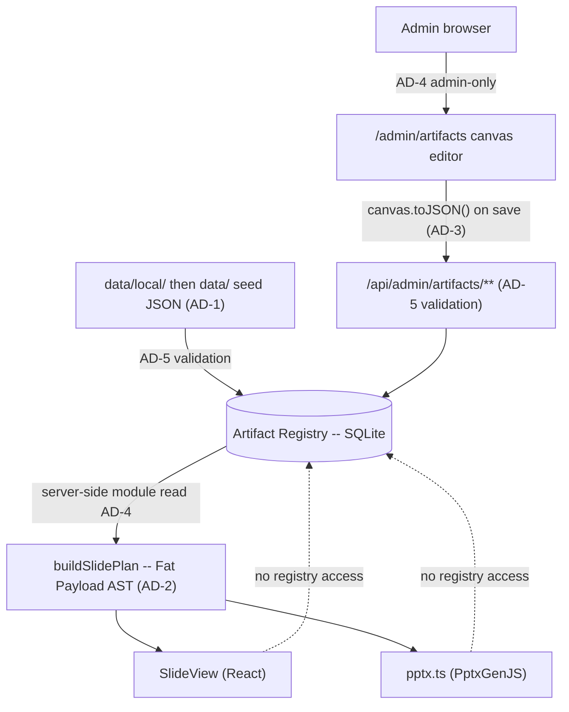

# Architecture Spine: Epic 16 (Slide Artifact Model)

## Paradigm
**Data-Driven Presentation Rendering with a Decoupled Editor.** A shift from hardcoded switch-statements to a purely JSON-driven layout AST (Abstract Syntax Tree) where an Uncontrolled Canvas Editor manages the design, and the renderers (React Web & PptxGenJS) act as dumb consumers of pre-hydrated ASTs.

## Inherited Invariants

Parent spine: `_bmad-output/planning-artifacts/architecture/architecture-bic-pptx-workflow-2026-07-10/ARCHITECTURE-SPINE.md` (initiative altitude). Its decisions bind here read-only and are **never renumbered**. **Citation convention:** parent decisions are cited as `INIT AD-n`; a bare `AD-n` inside this file always means an Epic 16 decision below.

| Inherited | From parent | Binds here |
| --- | --- | --- |
| INIT AD-1 — Web Hub + Offline PPTX | Initiative spine | Registry/AST changes must keep the downloadable PPTX path venue-independent; a registry edit may not make Sabbath rendering depend on hub connectivity. |
| INIT AD-2 — Single Repository Monolith | Initiative spine | Registry storage, admin editor UI, and both renderers ship in this repo as one deployable unit; no separate editor service. |
| INIT AD-3 — Decoupled Ingestion and Presentation | Initiative spine | Artifact templates are a presentation-layer concern; webhook/service intake JSON stays agnostic of layout templates. |
| INIT AD-4 — LiveServer durable paths | Initiative spine | Registry rows live in the durable `DB_PATH` SQLite; editor image references resolve through the existing `UPLOADS_DIR` / allowlist rules, never new ad-hoc paths. |
| INIT AD-5 — Single request gate (`src/proxy.ts`) | Initiative spine | `/admin/artifacts` and `/api/admin/artifacts/**` are gated by the proxy matcher and re-checked against SQLite. AD-4 below **specializes** this; it does not replace it. Adding a registry route outside the matcher requires the same-change-set test update the parent demands. |
| INIT AD-7 — `buildSlidePlan` is the only slide-order source | Initiative spine | AD-2's Fat Payload is the Epic 16 specialization of this rule; no renderer may order or lay out independently. |
| INIT AD-8 — Shared image-safety helpers | Initiative spine | Registry `/assets/...` refs validate through the shared helper; the editor introduces no second resolver and admits no `data:` or arbitrary remote URI. |
| INIT AD-9 — Schema evolution via startup DDL | Initiative spine | Registry tables are created on the `getDb` startup path; Epic 16 introduces no migration framework. |
| INIT AD-10 — One presenter sync channel | Initiative spine | A registry edit must not add a second `BroadcastChannel` or a server realtime channel to push template changes to a live projector. |
| Convention — kebab-case files, ISO 8601 UTC, JSON envelopes, thin route handlers | Initiative spine | Registry APIs and persisted timestamps follow the same conventions; registry logic lives in `src/lib/registry/*`, not in route handlers. |
| Stack — better-sqlite3 (WAL), pptxgenjs, fabric | Initiative spine + `package.json` | Storage target, PPTX generator, and canvas library are fixed; Epic 16 adds no parallel mechanism. |

## Architectural Decisions

### AD-1: Artifact Registry Storage
- **Binds:** Database schema, the Canvas Editor's save API, and the startup seed path.
- **Prevents:** Data loss on ephemeral container filesystems, file-lock concurrency issues, and a seeder that overwrites administrator edits or leaks private seed content.
- **Rule:** The live Artifact Registry is stored in SQLite on the durable `DB_PATH` (INIT AD-4). Filesystem JSON serves exclusively as a startup seed: startup inserts missing template IDs and **never** overwrites persisted administrator edits. Reset restores one selected template from that seed. The seed is two-layered — `data/local/default-registry.json` is git-ignored and **takes precedence over the shipped `data/default-registry.json` example whenever present**; a seeder that reads only the shipped example breaks the mechanism that keeps congregation data out of a public repository.

### AD-2: Slide Plan Data Flow (Fat Payload)
- **Binds:** The `buildSlidePlan` return type and all downstream renderers.
- **Prevents:** The Web (`SlideView`) and PPTX renderers from performing independent database lookups or maintaining their own diverging layout logic.
- **Rule:** `buildSlidePlan` outputs a fully hydrated AST (Fat Payload) with exact rendering coordinates, fonts, colors, and resolved text content. Specializes INIT AD-7: the plan is the single order *and* layout source, so a renderer never reaches the registry itself.

### AD-3: Canvas State Boundary
- **Binds:** The React-Fabric integration layer.
- **Prevents:** Two-way data binding lag, stuttering drags, and unnecessary React re-renders.
- **Rule:** The Canvas Editor uses an Uncontrolled Wrapper pattern. Fabric.js owns the canvas state exclusively; React only reads state via `canvas.toJSON()` when the save button is clicked.

### AD-4: Global Template Administration
- **Binds:** `/admin/artifacts`, `/api/admin/artifacts/**`, and the registry access layer.
- **Prevents:** Per-service template drift and operator-level mutation of every service's visual contract.
- **Rule:** Artifact templates are global across services. Registry management UI and APIs are admin-only and re-check the current account role from SQLite — a specialization of INIT AD-5, not a separate authorization scheme. Downstream planners and renderers read the registry through server-side modules rather than the management API.

### AD-5: Stable Layout Identity
- **Binds:** Seed data, every write path into the registry, hydration, and both renderers.
- **Prevents:** Unit-specific renderer drift, required-placeholder deletion, and unsafe image references reaching a renderer through an unvalidated back door.
- **Rule:** Layouts use a fixed 16:9 canvas with normalized percentage coordinates and stable template/layout/element/placeholder IDs. Coordinates may extend beyond the canvas to preserve intentional source-deck clipping. **Every** write into the registry is untrusted and must pass the same structural and image-reference validation before persistence — the canvas save API, the startup seeder, and any import or asset-extraction script alike. Image refs validate through the shared helper required by INIT AD-8; no write path ships its own check.

## Structural Seed

Dependency direction — the registry is read *through* the plan, never by a renderer, and never through the management API:

## Deferred
- Exact Canvas UI component layout (sidebar vs topbar) is a UX concern, not a structural invariant.
- Vocabulary additions the shipped validator does not admit — element rotation, layout-background opacity, image-element opacity — are deferred with evidence in `deferred-work.md`. Adding one is a registry-contract change, not a seed edit.
- Asset extraction for deck elements that have no registry element yet (e.g. the `offering-tithe` QR) is deferred; when it lands it is a *second* writer into the registry and is bound by AD-5.
